# 🍽️ JavaScript-এর রেস্টুরেন্ট: DOM Manipulation থেকে Asynchronous JavaScript

> এই ডকুমেন্টটা লেখা হয়েছে গল্প আকারে, যাতে concept গুলো শুধু মুখস্থ না হয়ে **মাথায় গেঁথে যায়**। Theory-এর সাথে সাথে example, আর যেখানে দরকার সেখানে Mermaid diagram দেওয়া আছে visualize করার জন্য।

---

## 📚 সূচিপত্র (Table of Contents)

1. [ভূমিকা: রেস্টুরেন্টের গল্প](#ভূমিকা-রেস্টুরেন্টের-গল্প)
2. [DOM কী এবং কেন](#১-dom-কী-এবং-কেন)
3. [DOM Selection - জিনিস খুঁজে বের করা](#২-dom-selection---জিনিস-খুঁজে-বের-করা)
4. [DOM Manipulation - জিনিস বদলানো](#৩-dom-manipulation---জিনিস-বদলানো)
5. [Event Handling - কাস্টমারের রিকোয়েস্ট শোনা](#৪-event-handling---কাস্টমারের-রিকোয়েস্ট-শোনা)
6. [Todo App: Bad Way (খারাপ পদ্ধতি)](#৫-todo-app-bad-way-খারাপ-পদ্ধতি)
7. [Todo App: Good Way (ভালো পদ্ধতি)](#৬-todo-app-good-way-ভালো-পদ্ধতি)
8. [Asynchronous JavaScript-এর জগতে প্রবেশ](#৭-asynchronous-javascript-এর-জগতে-প্রবেশ)
9. [Callback এবং Callback Hell](#৮-callback-এবং-callback-hell)
10. [Promise - প্রতিশ্রুতির গল্প](#৯-promise---প্রতিশ্রুতির-গল্প)
11. [Async/Await - সহজ ভাষায় Promise](#১০-asyncawait---সহজ-ভাষায়-promise)
12. [Event Loop - রেস্টুরেন্টের ম্যানেজার](#১১-event-loop---রেস্টুরেন্টের-ম্যানেজার)
13. [Fetch API - আসল দুনিয়ার Example](#১২-fetch-api---আসল-দুনিয়ার-example)
14. [সারসংক্ষেপ ও Practice আইডিয়া](#১৩-সারসংক্ষেপ-ও-practice-আইডিয়া)

---

## ভূমিকা: রেস্টুরেন্টের গল্প

কল্পনা করুন, একটা **রেস্টুরেন্ট** আছে। এই রেস্টুরেন্টটাই হলো আপনার **Webpage**।

- রেস্টুরেন্টের প্রতিটা টেবিল, চেয়ার, প্লেট, মেনু কার্ড — এগুলো হলো **HTML Elements**।
- পুরো রেস্টুরেন্টের ভেতরের জিনিসপত্রের একটা **তালিকা বা map** আছে, যেটা দেখে ম্যানেজার বুঝতে পারে কোথায় কী আছে — এই map-টাই হলো **DOM (Document Object Model)**।
- আর **JavaScript** হলো রেস্টুরেন্টের **ওয়েটার** — যে কাস্টমারের (User-এর) কথা শোনে, আর সেই অনুযায়ী টেবিল সাজায়, প্লেট বদলায়, নতুন চেয়ার আনে।

এখন প্রশ্ন হলো — ওয়েটার (JS) কীভাবে বুঝবে রেস্টুরেন্টে (Webpage-এ) কী কী আছে, আর কীভাবে সে জিনিসপত্র বদলাবে? সেটাই হলো **DOM Manipulation**।

আর রেস্টুরেন্টে কিছু কাজ **সাথে সাথে** হয় (যেমন কাস্টমারকে "স্বাগতম" বলা), আবার কিছু কাজ **সময় নেয়** (যেমন রান্নাঘর থেকে খাবার তৈরি হয়ে আসা)। এই "সময় নেওয়া" কাজগুলো সামলানোর নিয়মটাই হলো **Asynchronous JavaScript**।

চলুন, পুরো গল্পটা ধাপে ধাপে বুঝি।

---

## ১. DOM কী এবং কেন

### থিওরি

ব্রাউজার যখন একটা HTML ফাইল লোড করে, তখন সে HTML-কে শুধু টেক্সট হিসেবে না রেখে একটা **ট্রি-আকৃতির অবজেক্ট** বানিয়ে ফেলে মেমোরিতে। এই ট্রি-টাই হলো **DOM (Document Object Model)**।

এটাকে ভাবুন রেস্টুরেন্টের একটা **organizational chart**-এর মতো:
- সবার উপরে থাকে রেস্টুরেন্ট নিজে (`document`)
- তার নিচে থাকে বিল্ডিং (`html`)
- বিল্ডিং-এর ভেতরে থাকে রান্নাঘর আর ডাইনিং হল (`head`, `body`)
- ডাইনিং হলের ভেতরে থাকে টেবিল, চেয়ার (`div`, `h1`, `p`, `button`...)

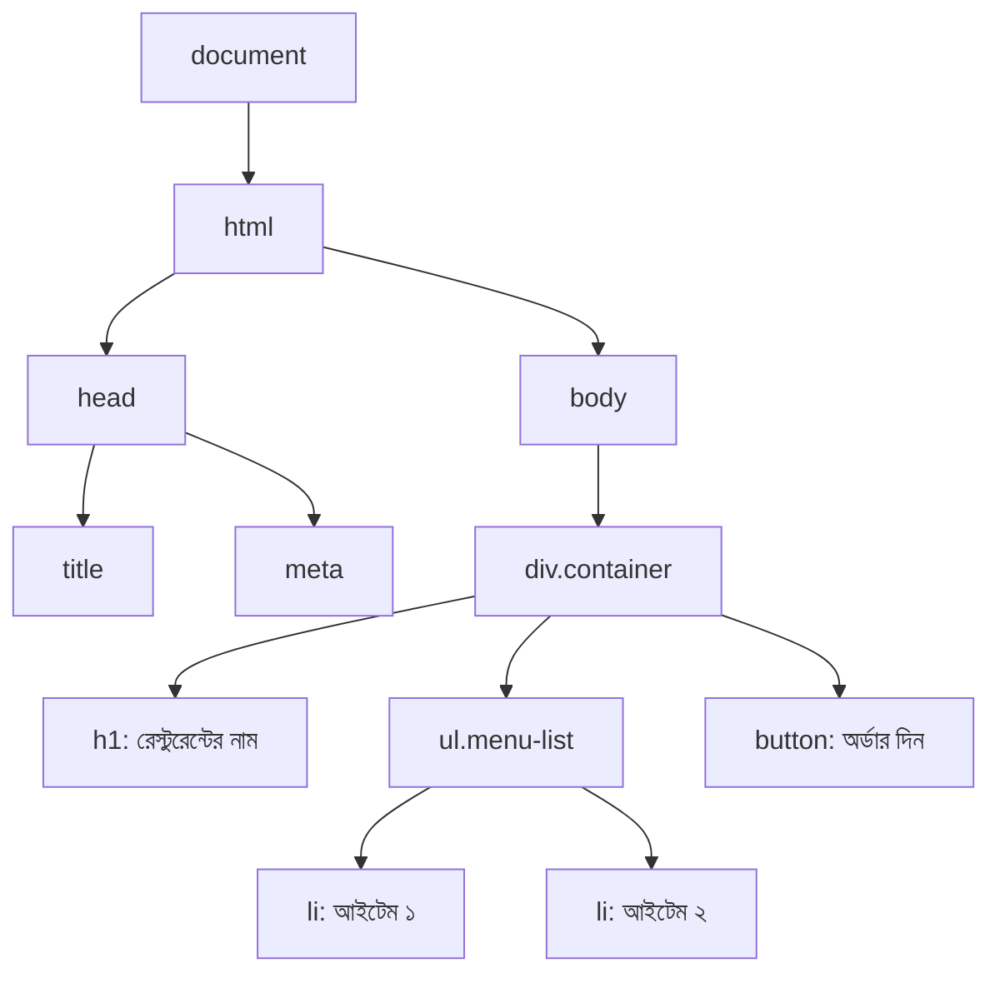

**গুরুত্বপূর্ণ পয়েন্ট:**
- DOM হলো HTML-এর একটা **live representation** — মানে JS দিয়ে DOM বদলালে, স্ক্রিনেও সাথে সাথে বদলে যায়।
- DOM আর HTML source code একই জিনিস না। DOM হলো ব্রাউজারের মেমোরিতে বানানো একটা **object structure**, যেটা JS দিয়ে access আর modify করা যায়।

---

## ২. DOM Selection - জিনিস খুঁজে বের করা

ওয়েটার (JS) যদি কোনো নির্দিষ্ট টেবিলে (Element-এ) কাজ করতে চায়, তাহলে আগে তাকে সেই টেবিলটা **খুঁজে বের করতে হবে**। এই কাজটাই হলো **Selection**।

### সবচেয়ে বেশি ব্যবহৃত মেথডগুলো

| মেথড | কাজ | উদাহরণ |
|---|---|---|
| `getElementById()` | ID দিয়ে একটা element খুঁজবে | `document.getElementById("menu")` |
| `getElementsByClassName()` | Class দিয়ে সব element (HTMLCollection) | `document.getElementsByClassName("item")` |
| `getElementsByTagName()` | Tag নাম দিয়ে সব element | `document.getElementsByTagName("li")` |
| `querySelector()` | CSS selector দিয়ে **প্রথম** element | `document.querySelector(".item")` |
| `querySelectorAll()` | CSS selector দিয়ে **সব** element (NodeList) | `document.querySelectorAll(".item")` |

### গল্প দিয়ে বুঝি

ওয়েটারকে ম্যানেজার বললো:

- **"৫ নম্বর টেবিলে যাও"** → এইটা হলো `getElementById("table-5")` — কারণ ID সবসময় **ইউনিক**, একটাই টেবিল আছে ৫ নম্বর বলে।
- **"যত টেবিলে লাল কাপড় বিছানো আছে সবগুলাতে যাও"** → এটা হলো `getElementsByClassName("red-cloth")` বা `querySelectorAll(".red-cloth")` — কারণ একই class-এর একাধিক টেবিল থাকতে পারে।

```javascript
// উদাহরণ
const menuTitle = document.getElementById("menu-title");
const allMenuItems = document.querySelectorAll(".menu-item");

console.log(menuTitle.textContent); // "আজকের স্পেশাল মেনু"
console.log(allMenuItems.length);   // ধরুন ৫টা আইটেম আছে
```

> **টিপস:** আজকাল বেশিরভাগ ডেভেলপার `querySelector` / `querySelectorAll` বেশি ব্যবহার করে, কারণ এটা CSS selector-এর মতো (`.class`, `#id`, `div > p`) যেকোনো কম্বিনেশন সাপোর্ট করে — একটাই মেথড দিয়ে সব ধরনের খোঁজাখুঁজি করা যায়।

---

## ৩. DOM Manipulation - জিনিস বদলানো

খুঁজে পাওয়ার পর ওয়েটারের আসল কাজ শুরু — টেবিল সাজানো, নতুন প্লেট আনা, পুরোনো প্লেট সরানো।

### ৩.১ Content বদলানো

```javascript
const title = document.querySelector("h1");
title.textContent = "স্বাগতম আমাদের রেস্টুরেন্টে!"; // শুধু টেক্সট বসাবে
title.innerHTML = "স্বাগতম <b>আমাদের</b> রেস্টুরেন্টে!"; // HTML সহ বসাবে
```

⚠️ **সতর্কতা:** `innerHTML` ব্যবহার করার সময় সাবধান — ইউজারের ইনপুট সরাসরি `innerHTML`-এ বসালে **XSS (Cross-Site Scripting)** ঝুঁকি তৈরি হয়। ইউজার ইনপুটের জন্য সবসময় `textContent` ব্যবহার করা নিরাপদ।

### ৩.২ নতুন Element তৈরি ও যোগ করা

```javascript
// নতুন প্লেট (li) বানানো
const newItem = document.createElement("li");
newItem.textContent = "চিকেন বিরিয়ানি";
newItem.classList.add("menu-item");

// টেবিলে (ul-এ) প্লেটটা রাখা
const menuList = document.querySelector(".menu-list");
menuList.appendChild(newItem);       // শেষে যোগ করবে
menuList.prepend(newItem);           // শুরুতে যোগ করবে
menuList.insertBefore(newItem, menuList.children[2]); // নির্দিষ্ট জায়গায়
```

### ৩.৩ Element সরানো

```javascript
newItem.remove(); // মডার্ন উপায়
// অথবা পুরোনো উপায়
menuList.removeChild(newItem);
```

### ৩.৪ Attribute ও Style বদলানো

```javascript
newItem.setAttribute("data-price", "350");
newItem.style.color = "green";
newItem.classList.toggle("sold-out"); // থাকলে বাদ, না থাকলে যোগ
```

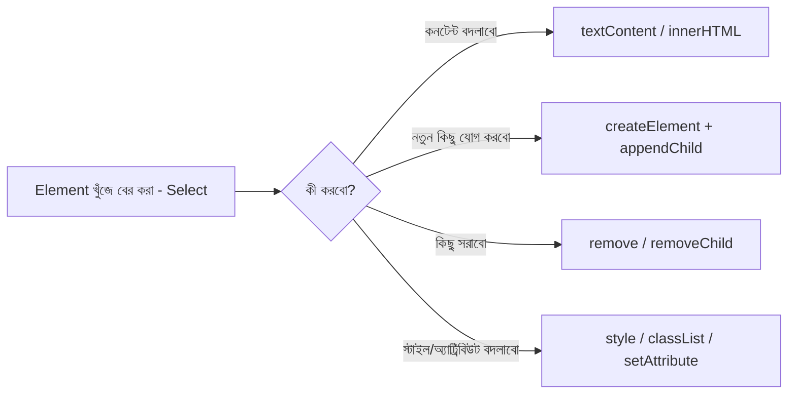

---

## ৪. Event Handling - কাস্টমারের রিকোয়েস্ট শোনা

শুধু টেবিল সাজালেই হবে না, ওয়েটারকে **কাস্টমারের কথা শুনতেও হবে** — কাস্টমার হাত তুললে (click করলে), বা কিছু বললে (type করলে) সেই অনুযায়ী react করতে হবে।

```javascript
const orderButton = document.querySelector(".order-btn");

orderButton.addEventListener("click", function () {
  alert("আপনার অর্ডার নেওয়া হয়েছে!");
});
```

### সাধারণ Event গুলো

- `click` — ক্লিক করলে
- `input` / `change` — টাইপ করলে বা ইনপুট বদলালে
- `submit` — ফর্ম সাবমিট করলে
- `keydown` / `keyup` — কীবোর্ড চাপলে
- `mouseover` / `mouseout` — মাউস আসলে/গেলে

### Event Bubbling — গল্প দিয়ে বুঝি

কাস্টমার যদি একটা প্লেটে টোকা দেয় (click করে), তাহলে শুধু প্লেট না, প্লেট যে টেবিলে আছে, সেই টেবিলও "টের পায়", টেবিল যে হলে আছে সেই হলও টের পায় — এভাবে ঘটনাটা **বুদবুদের মতো উপরের দিকে উঠতে থাকে**। একেই বলে **Event Bubbling**।

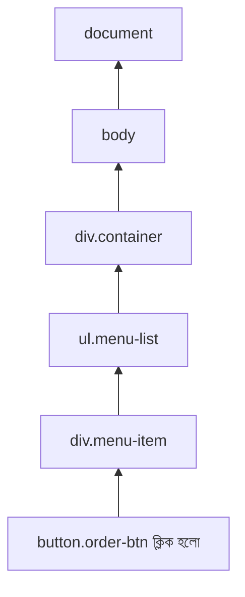

এই কারণেই **Event Delegation** নামে একটা টেকনিক আছে — যেটা আমরা একটু পরে Todo App-এর "Good Way"-তে ব্যবহার করবো।

---

## ৫. Todo App: Bad Way (খারাপ পদ্ধতি)

এবার আসল গল্পে আসি — একটা **Todo App** বানাবো, যেখানে ইউজার টাস্ক লিখবে, লিস্টে যোগ হবে, আর "Done" মার্ক বা ডিলিট করতে পারবে।

প্রথমে দেখি, **নতুন এবং শেখার পর্যায়ে থাকা ডেভেলপাররা** সাধারণত কীভাবে লেখে (যেটাকে আমরা "Bad Way" বলছি)।

### HTML

```html
<div class="container">
  <input type="text" id="taskInput" />
  <button id="addBtn">Add</button>
  <ul id="taskList"></ul>
</div>
```

### JavaScript (Bad Way)

```javascript
document.getElementById("addBtn").addEventListener("click", function () {
  const input = document.getElementById("taskInput");
  const value = input.value;

  const li = document.createElement("li");
  li.innerHTML = value + ' <button class="del">X</button> <button class="done">✓</button>';

  document.getElementById("taskList").appendChild(li);

  // প্রতিটা নতুন লি-এর জন্য আলাদা করে লিসেনার বসাতে হচ্ছে!
  li.querySelector(".del").addEventListener("click", function () {
    li.remove();
  });

  li.querySelector(".done").addEventListener("click", function () {
    li.style.textDecoration = "line-through";
  });

  input.value = "";
});
```

### 🚨 এখানে কী কী সমস্যা আছে?

1. **Repeated Event Listener সমস্যা:** প্রতিটা নতুন টাস্ক তৈরির সময় নতুন করে `.del` আর `.done` বাটনে listener বসাতে হচ্ছে। ১০০টা টাস্ক হলে ২০০টা listener মেমোরিতে বসে থাকবে — এটা **memory-inefficient**।
2. **innerHTML দিয়ে সরাসরি ইউজার ইনপুট বসানো হচ্ছে** — XSS ঝুঁকি। ইউজার যদি `<script>` ট্যাগ লিখে ফেলে, সেটা রান হয়ে যেতে পারে।
3. **কোনো "state" নেই** — মানে টাস্কগুলোর তথ্য কোথাও JS variable/array-এ সংরক্ষিত না, শুধু DOM-এই আছে। পেজ রিফ্রেশ দিলে সব উধাও, আর ভবিষ্যতে localStorage বা backend-এ সেভ করা কঠিন হয়ে যাবে।
4. **কোনো validation নেই** — খালি ইনপুট দিয়েও "Add" চাপলে খালি টাস্ক যোগ হয়ে যাবে।
5. **কোড ছড়ানো-ছিটানো (spaghetti)** — সব লজিক একটা click handler-এর ভেতরেই গাদাগাদি করে রাখা, যেটা বড় অ্যাপে maintain করা কঠিন হয়ে যায়।

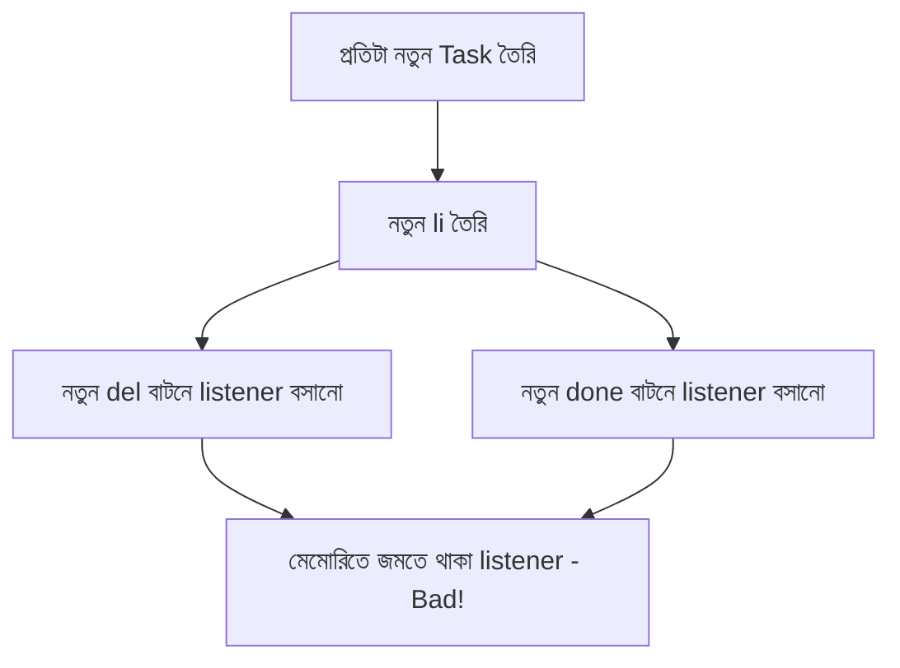

---

## ৬. Todo App: Good Way (ভালো পদ্ধতি)

এবার একই App-টা **সঠিক পদ্ধতিতে** বানাবো — যেখানে **state**, **event delegation**, আর **re-render pattern** ব্যবহার হবে। এটাই মূলত React-এর মতো ফ্রেমওয়ার্কগুলো যে মূলনীতির উপর দাঁড়িয়ে আছে, তার একটা ছোট ভার্সন — vanilla JS দিয়ে।

### মূল আইডিয়া: "State আগে, DOM পরে"

রেস্টুরেন্টের ম্যানেজারের কাছে একটা **মাস্টার খাতা (state)** থাকে, যেখানে সব অর্ডারের হিসাব লেখা থাকে। ডাইনিং হলে (DOM-এ) যা দেখা যায়, সেটা শুধু ওই খাতার **প্রতিফলন (reflection)**। খাতা বদলালেই হলের সাজসজ্জা নতুন করে সাজানো হয় (re-render)।

```javascript
// ১. State — একমাত্র সত্যের উৎস (Single Source of Truth)
let tasks = [];

// ২. DOM রেফারেন্স একবারই নেওয়া
const taskInput = document.getElementById("taskInput");
const addBtn = document.getElementById("addBtn");
const taskList = document.getElementById("taskList");

// ৩. Render ফাংশন — state অনুযায়ী পুরো লিস্ট নতুন করে আঁকা
function renderTasks() {
  taskList.innerHTML = ""; // পুরোনো UI মুছে ফেলা

  tasks.forEach((task) => {
    const li = document.createElement("li");
    li.dataset.id = task.id; // কোন টাস্ক সেটা চেনার জন্য
    li.textContent = task.text;

    if (task.done) {
      li.style.textDecoration = "line-through";
    }

    const doneBtn = document.createElement("button");
    doneBtn.textContent = "✓";
    doneBtn.classList.add("done-btn");

    const delBtn = document.createElement("button");
    delBtn.textContent = "X";
    delBtn.classList.add("del-btn");

    li.append(doneBtn, delBtn);
    taskList.appendChild(li);
  });
}

// ৪. নতুন টাস্ক যোগ করা — শুধু state বদলাবে, তারপর render কল করবে
function addTask() {
  const value = taskInput.value.trim();
  if (value === "") return; // validation

  tasks.push({
    id: Date.now(),
    text: value,
    done: false,
  });

  taskInput.value = "";
  renderTasks();
}

addBtn.addEventListener("click", addTask);

// এন্টার চাপলেও যোগ হবে
taskInput.addEventListener("keydown", (e) => {
  if (e.key === "Enter") addTask();
});

// ৫. Event Delegation — একটাই listener পুরো লিস্টের জন্য
taskList.addEventListener("click", function (e) {
  const li = e.target.closest("li");
  if (!li) return;

  const id = Number(li.dataset.id);

  if (e.target.classList.contains("del-btn")) {
    tasks = tasks.filter((task) => task.id !== id);
    renderTasks();
  }

  if (e.target.classList.contains("done-btn")) {
    tasks = tasks.map((task) =>
      task.id === id ? { ...task, done: !task.done } : task
    );
    renderTasks();
  }
});

// প্রথমবার খালি লিস্ট দেখানো
renderTasks();
```

### ✅ এই পদ্ধতিতে কী কী ভালো হলো?

| সমস্যা (Bad Way) | সমাধান (Good Way) |
|---|---|
| প্রতিটা আইটেমে আলাদা listener | `taskList`-এ **একটাই** listener — **Event Delegation** |
| কোনো state নেই | `tasks` array-ই একমাত্র সত্যের উৎস |
| XSS ঝুঁকি | `textContent` ব্যবহার, `createElement` দিয়ে নিরাপদে element তৈরি |
| Validation নেই | খালি ইনপুট চেক করা হচ্ছে |
| রিফ্রেশে ডেটা হারায় | সহজেই `localStorage.setItem()` দিয়ে extend করা যাবে |
| কোড এলোমেলো | প্রতিটা কাজের জন্য আলাদা ফাংশন — readable ও maintainable |

### Event Delegation কীভাবে কাজ করে (আগের Bubbling কনসেপ্ট মনে আছে?)

যেহেতু ক্লিক ইভেন্ট বুদবুদের মতো উপরে উঠতে থাকে, তাই আমরা প্রতিটা বাটনে আলাদা listener না বসিয়ে, তাদের **প্যারেন্ট (`taskList`)**-এ একটা listener বসাই। যখনই ভেতরের কোনো বাটনে ক্লিক হয়, ইভেন্টটা bubble হয়ে parent পর্যন্ত পৌঁছায়, আর আমরা `e.target` দেখে বুঝে নিই আসলে কোন বাটনে ক্লিক হয়েছে।

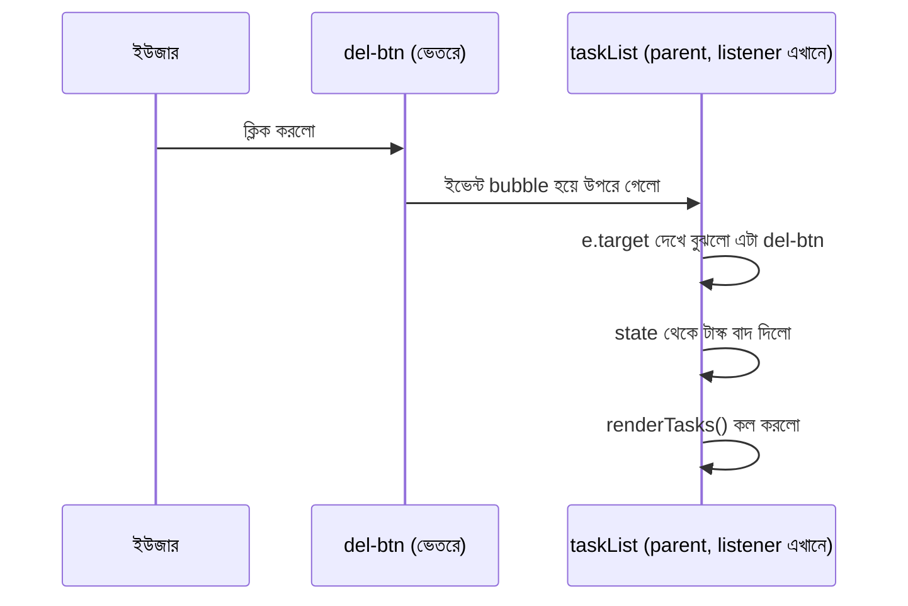

---

## ৭. Asynchronous JavaScript-এর জগতে প্রবেশ

এখন পর্যন্ত আমরা যা করেছি, সব **সাথে সাথে (synchronous)** হয়েছে — একটা লাইন শেষ হলে পরের লাইন চলে।

কিন্তু বাস্তব দুনিয়ায় রেস্টুরেন্টে সব কাজ সাথে সাথে হয় না। কাস্টমার অর্ডার দিলো, কিন্তু **খাবার তৈরি হতে সময় লাগে**। এখন ওয়েটারের দুটো অপশন:

1. **রান্নাঘরের সামনে দাঁড়িয়ে থেকে অপেক্ষা করা** (Synchronous/Blocking) — এই সময়ে ওয়েটার আর কোনো কাস্টমারের কথা শুনতে পারবে না, পুরো রেস্টুরেন্ট থমকে থাকবে। 😱
2. **অর্ডারটা রান্নাঘরে দিয়ে অন্য কাস্টমারদের সার্ভ করতে চলে যাওয়া, খাবার তৈরি হলে রান্নাঘর থেকে ডাক পড়বে** (Asynchronous/Non-blocking) — এটাই বাস্তবসম্মত এবং JavaScript এই পদ্ধতিতেই কাজ করে।

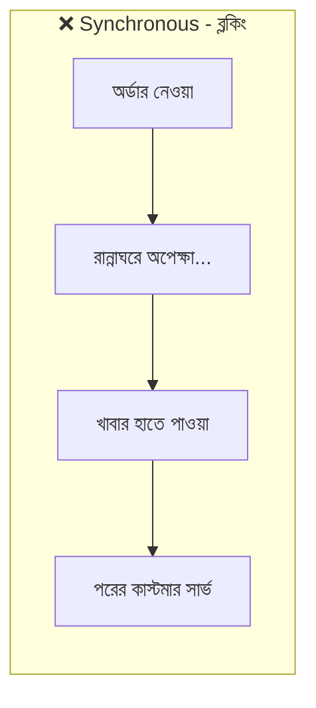

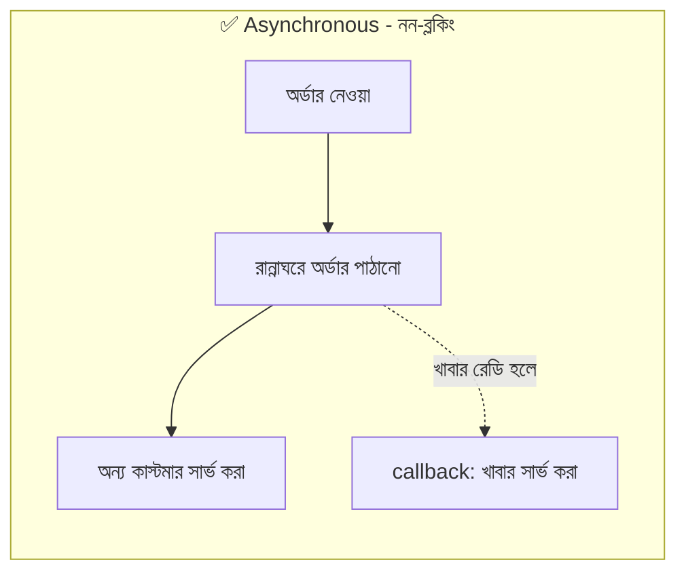

JavaScript **single-threaded** ভাষা — মানে একসাথে একটাই কাজ করতে পারে। কিন্তু ব্রাউজার (বা Node.js) তাকে সাহায্য করে **Web APIs** (timer, network request ইত্যাদি) দিয়ে, যাতে সময়সাপেক্ষ কাজ ব্যাকগ্রাউন্ডে চলতে থাকে আর মূল থ্রেড আটকে না যায়।

---

## ৮. Callback এবং Callback Hell

### Callback কী?

**Callback** হলো এমন একটা ফাংশন, যেটাকে অন্য একটা ফাংশনের **আর্গুমেন্ট হিসেবে পাঠানো হয়**, আর একটা নির্দিষ্ট কাজ শেষ হলে সেটা **"কল ব্যাক" (ফিরে ডাকা)** হয়।

```javascript
function prepareFood(orderName, callback) {
  console.log(orderName + " তৈরি হচ্ছে...");

  setTimeout(function () {
    console.log(orderName + " রেডি!");
    callback(); // খাবার রেডি হলে ওয়েটারকে জানানো
  }, 2000);
}

prepareFood("বিরিয়ানি", function () {
  console.log("ওয়েটার খাবারটা টেবিলে দিয়ে আসলো।");
});
```

### 😵 Callback Hell — গল্প দিয়ে বুঝি

মনে করুন, রান্নাঘরে একটা অর্ডার শেষ হলেই পরের ধাপ শুরু হবে — যেমন: **আগে চাল ধুতে হবে → তারপর রান্না করতে হবে → তারপর প্লেটে সাজাতে হবে → তারপর সার্ভ করতে হবে**। প্রতিটা ধাপ আগের ধাপের উপর নির্ভরশীল (dependent), আর প্রতিটাই সময় নেয়।

```javascript
washRice(function () {
  cookRice(function () {
    plateRice(function () {
      serveRice(function () {
        console.log("অবশেষে খাবার সার্ভ হলো!");
      });
    });
  });
});
```

এই যে ধাপে ধাপে ফাংশনের ভেতরে ফাংশন ঢুকতে ঢুকতে কোডটা **ডানদিকে সিঁড়ির মতো নেমে যাচ্ছে** — একেই বলে **"Callback Hell"** বা **"Pyramid of Doom"**। এটা পড়া কঠিন, ডিবাগ করা কঠিন, আর error handling জটিল হয়ে যায়।

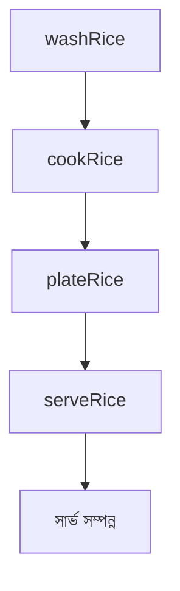

এই সমস্যার সমাধান হিসেবেই এলো **Promise**।

---

## ৯. Promise - প্রতিশ্রুতির গল্প

### গল্প দিয়ে বুঝি

আপনি রেস্টুরেন্টে অর্ডার দিলেন। ওয়েটার আপনাকে একটা **"টোকেন" (token)** দিলো, যেখানে লেখা: *"আপনার খাবার তৈরি হচ্ছে, রেডি হলে জানানো হবে।"* এই টোকেনটাই হলো একটা **Promise**।

এই টোকেনের **৩টা অবস্থা (state)** থাকতে পারে:

1. **Pending (অপেক্ষমান)** — এখনো রান্না হচ্ছে
2. **Fulfilled (সফল)** — খাবার রেডি, আপনি পেয়ে গেলেন ✅
3. **Rejected (ব্যর্থ)** — দুঃখিত, ওই আইটেম শেষ হয়ে গেছে ❌

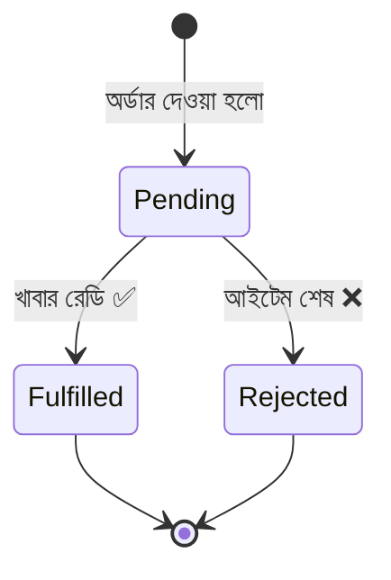

### কোড দিয়ে বুঝি

```javascript
function prepareFood(orderName) {
  return new Promise(function (resolve, reject) {
    setTimeout(function () {
      const isAvailable = Math.random() > 0.3; // ৭০% সম্ভাবনা পাওয়া যাবে

      if (isAvailable) {
        resolve(orderName + " রেডি হয়ে গেছে!");
      } else {
        reject(orderName + " দুঃখিত, এই আইটেম শেষ!");
      }
    }, 2000);
  });
}

prepareFood("বিরিয়ানি")
  .then(function (message) {
    console.log("✅ " + message);
  })
  .catch(function (error) {
    console.log("❌ " + error);
  })
  .finally(function () {
    console.log("অর্ডার প্রসেস শেষ।");
  });
```

### Promise Chaining — আগের Callback Hell-এর সমাধান

```javascript
washRice()
  .then(() => cookRice())
  .then(() => plateRice())
  .then(() => serveRice())
  .then(() => console.log("অবশেষে খাবার সার্ভ হলো!"))
  .catch((error) => console.log("কোথাও সমস্যা হয়েছে:", error));
```

দেখুন — সিঁড়ির মতো নিচে নামার বদলে, এখন কোডটা **সোজা লাইনে (flat chain)** পড়া যাচ্ছে। এটাই Promise-এর সবচেয়ে বড় সুবিধা — **readability**।

### Promise.all() — একসাথে অনেকগুলো অর্ডার

মনে করুন, একটা টেবিলের সবার খাবার **একসাথে রেডি হওয়ার পরই** সার্ভ করতে হবে (কেউ আগে, কেউ পরে খেলে বাজে দেখাবে)।

```javascript
Promise.all([
  prepareFood("বিরিয়ানি"),
  prepareFood("কাবাব"),
  prepareFood("বোরহানি"),
])
  .then((allFoods) => {
    console.log("সবার খাবার একসাথে রেডি:", allFoods);
  })
  .catch((error) => {
    console.log("কোনো একটা আইটেমে সমস্যা হয়েছে:", error);
  });
```

---

## ১০. Async/Await - সহজ ভাষায় Promise

`.then().then().then()` চেইনও অনেক সময় একটু জটিল লাগে। তাই ES2017-এ এলো **`async/await`** — যেটা Promise-কেই **synchronous style-এ লেখার একটা "সুন্দর মোড়ক" (syntactic sugar)**।

### গল্প দিয়ে বুঝি

`await` মানে ওয়েটার বলছে — *"আমি এখানে দাঁড়িয়ে অপেক্ষা করবো, যতক্ষণ না এই নির্দিষ্ট খাবারটা রেডি হয়, কিন্তু রেস্টুরেন্টের বাকি সব কাজ (অন্য টেবিল, অন্য অর্ডার) ঠিকই চলতে থাকবে"* — কারণ `await` শুধু ওই নির্দিষ্ট `async` ফাংশনের ভেতরের কোড পরের লাইনে যেতে দেরি করায়, পুরো প্রোগ্রাম না।

### কোড দিয়ে বুঝি

```javascript
async function serveDinner() {
  try {
    await washRice();
    await cookRice();
    await plateRice();
    await serveRice();
    console.log("অবশেষে খাবার সার্ভ হলো!");
  } catch (error) {
    console.log("কোথাও সমস্যা হয়েছে:", error);
  }
}

serveDinner();
```

### Promise chain বনাম Async/Await — পাশাপাশি তুলনা

```javascript
// Promise Chain
function getOrder() {
  return prepareFood("বিরিয়ানি")
    .then((food) => {
      console.log(food);
      return checkPayment();
    })
    .then((payment) => {
      console.log(payment);
    })
    .catch((err) => console.log(err));
}

// একই জিনিস Async/Await দিয়ে
async function getOrder() {
  try {
    const food = await prepareFood("বিরিয়ানি");
    console.log(food);

    const payment = await checkPayment();
    console.log(payment);
  } catch (err) {
    console.log(err);
  }
}
```

দেখুন, `async/await` দিয়ে লেখা কোডটা **উপর থেকে নিচে সাধারণ synchronous কোডের মতোই পড়া যাচ্ছে** — এটাই এর সবচেয়ে বড় সুবিধা।

> **মনে রাখার নিয়ম:** `await` শুধুমাত্র `async` ফাংশনের ভেতরেই ব্যবহার করা যায় (Top-level await ছাড়া, যেটা modern JS module-এ সাপোর্টেড)। `try...catch` দিয়ে error handle করা হয়, `.catch()`-এর বদলে।

---

## ১১. Event Loop - রেস্টুরেন্টের ম্যানেজার

এবার সবচেয়ে গুরুত্বপূর্ণ প্রশ্ন — JavaScript যেহেতু **single-threaded**, তাহলে সে কীভাবে একসাথে অনেকগুলো async কাজ সামলায়? এর উত্তর হলো **Event Loop**।

### রেস্টুরেন্টের সাথে তুলনা

- **Call Stack** = ওয়েটার এখন যে কাজটা হাতে নিয়ে করছে (এক সময়ে একটাই কাজ)
- **Web APIs** = রান্নাঘর, যেখানে সময়সাপেক্ষ কাজ (রান্না, timer, network call) চলতে থাকে ব্যাকগ্রাউন্ডে
- **Callback Queue (Macrotask Queue)** = রান্না শেষ হওয়া প্লেটগুলো যে লাইনে সার্ভ হওয়ার অপেক্ষায় থাকে (`setTimeout`, `setInterval`)
- **Microtask Queue** = **VIP লাইন** — Promise-এর `.then()`/`.catch()` এখানে অপেক্ষা করে, আর এটা সবসময় সাধারণ Callback Queue-এর **আগে** সার্ভ হয়
- **Event Loop** = ম্যানেজার, যে সারাক্ষণ চেক করে — *"Call Stack কি খালি? তাহলে আগে Microtask Queue থেকে, তারপর Callback Queue থেকে পরের কাজ নিয়ে আসি।"*

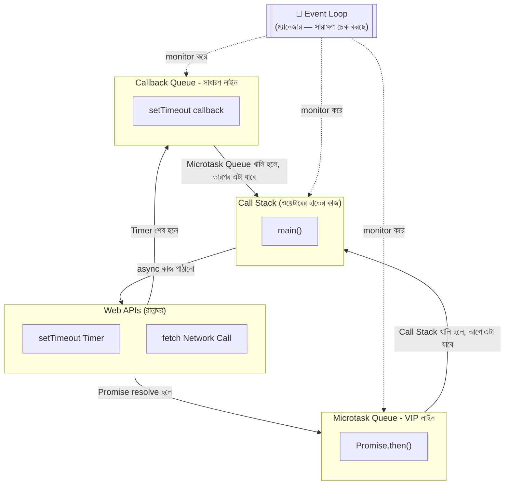

### একটা মজার উদাহরণ দিয়ে বুঝি Execution Order

```javascript
console.log("১. অর্ডার শুরু");

setTimeout(() => {
  console.log("৪. Timer শেষ (Callback Queue)");
}, 0);

Promise.resolve().then(() => {
  console.log("৩. Promise resolve (Microtask Queue)");
});

console.log("২. অর্ডার শেষ");
```

**আউটপুট হবে:**
```
১. অর্ডার শুরু
২. অর্ডার শেষ
৩. Promise resolve (Microtask Queue)
৪. Timer শেষ (Callback Queue)
```

**কেন এমন হলো?**
1. প্রথমে সব **synchronous** কোড (`console.log("১...")`, `console.log("২...")`) সরাসরি Call Stack-এ চলে, তাই আগে রান হয়।
2. `setTimeout` এর সময় `0ms` দিলেও, সে সরাসরি Call Stack-এ যায় না — আগে Web API-তে যায়, তারপর Callback Queue-তে অপেক্ষা করে।
3. Promise-এর `.then()` যায় **Microtask Queue**-তে, যেটা Callback Queue-এর চেয়ে **অগ্রাধিকার** পায়।
4. Event Loop প্রথমে Call Stack খালি করে, তারপর Microtask Queue পুরোপুরি খালি করে, **তারপর** Callback Queue থেকে একটা করে কাজ নেয়।

এই জন্যই Promise-ভিত্তিক (৩) কাজ, Timer-ভিত্তিক (৪) কাজের **আগে** রান হলো, যদিও দুটোই async এবং Timer-এ `0ms` দেওয়া হয়েছিলো।

---

## ১২. Fetch API - আসল দুনিয়ার Example

Real-life-এ সবচেয়ে বেশি async কাজ হয় **server থেকে ডেটা আনার সময়** — যেটাকে বলে **API call**। এটাই আপনার রেস্টুরেন্টের **সাপ্লায়ারের কাছ থেকে কাঁচামাল আনার** মতো।

### Promise-based

```javascript
fetch("https://api.example.com/menu")
  .then((response) => response.json())
  .then((data) => {
    console.log("মেনু পাওয়া গেছে:", data);
  })
  .catch((error) => {
    console.log("মেনু আনতে সমস্যা হয়েছে:", error);
  });
```

### Async/Await-based (বেশি clean)

```javascript
async function getMenu() {
  try {
    const response = await fetch("https://api.example.com/menu");

    if (!response.ok) {
      throw new Error("Server-এ সমস্যা: " + response.status);
    }

    const data = await response.json();
    console.log("মেনু পাওয়া গেছে:", data);
    return data;
  } catch (error) {
    console.log("মেনু আনতে সমস্যা হয়েছে:", error);
  }
}

getMenu();
```

### WordPress/PHP প্রসঙ্গে (যেহেতু আপনি মূলত এই স্ট্যাকেই কাজ করেন)

আপনার WordPress কাজের সাথে মিলিয়ে বললে — এই `fetch()` কনসেপ্টটাই আপনি **WordPress REST API** বা **AJAX (`wp_ajax_`)** endpoint কল করার সময় ব্যবহার করবেন:

```javascript
async function loadWooProducts() {
  try {
    const res = await fetch("/wp-json/wc/store/v1/products");
    const products = await res.json();
    console.log(products);
  } catch (err) {
    console.error("প্রোডাক্ট লোড করতে সমস্যা:", err);
  }
}
```

---

## ১৩. সারসংক্ষেপ ও Practice আইডিয়া

### পুরো গল্পের সারমর্ম

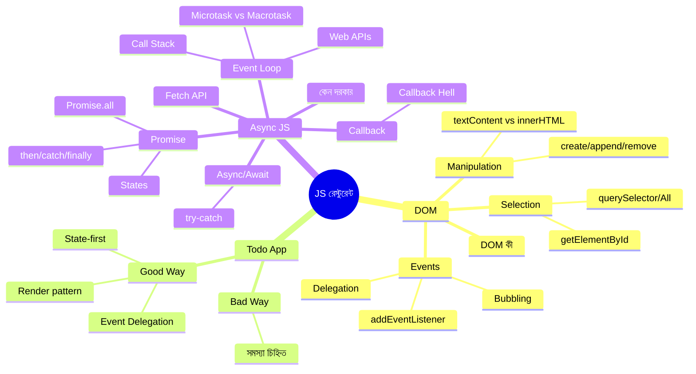

### Practice-এর জন্য নতুন কিছু বানানোর আইডিয়া (আপনার জন্য suggest করছি)

যেহেতু এই টপিকগুলো আপনি Git-এ আপলোড করবেন, নিচের ছোট প্রজেক্টগুলো বানিয়ে repo-তে রাখতে পারেন — প্রতিটাতেই DOM + Async দুটোই প্র্যাকটিস হবে:

1. **Weather App** — একটা input-এ শহরের নাম দিলে, `fetch` দিয়ে Weather API কল করে DOM-এ রেজাল্ট দেখানো (async/await + DOM manipulation)।
2. **Debounced Search Box** — টাইপ করার সাথে সাথে না খুঁজে, থামার পর `setTimeout` দিয়ে delay করে search করা (Event Loop প্র্যাকটিস)।
3. **Promise.all() দিয়ে Multi-API Dashboard** — একসাথে ৩টা API কল করে (যেমন: news, weather, quote) একটা ড্যাশবোর্ডে দেখানো।
4. **Todo App-টাকে extend করা** — `localStorage` যোগ করে ডেটা persist করা, আর সম্ভব হলে WordPress REST API দিয়ে backend-এ সেভ করা (আপনার WooCommerce/WordPress ব্যাকগ্রাউন্ডের সাথে খুব ভালো যাবে)।

---

## 📌 GitHub README-এ যেভাবে সাজাতে পারেন

এই ফাইলটাকে আপনি সরাসরি `README.md` হিসেবে repo-তে রাখতে পারবেন — উপরের **Table of Contents**-এর প্রতিটা লিংক GitHub-এ অটোমেটিক্যালি কাজ করবে (heading anchor)। প্রতিটা কোড ব্লকে syntax highlighting আছে (`javascript`, `html`), আর সব Mermaid diagram GitHub natively render করে, তাই কোনো extra সেটআপ ছাড়াই সব ছবি সহ দেখাবে।

চাইলে repo structure এমন রাখতে পারেন:

```
📦 dom-and-async-js-notes
 ┣ 📜 README.md              ← এই ফাইলটা
 ┣ 📂 todo-app-bad-way/
 ┃ ┣ 📜 index.html
 ┃ ┗ 📜 script.js
 ┣ 📂 todo-app-good-way/
 ┃ ┣ 📜 index.html
 ┃ ┗ 📜 script.js
 ┗ 📂 async-examples/
   ┣ 📜 callback-example.js
   ┣ 📜 promise-example.js
   ┗ 📜 async-await-example.js
```

এভাবে থিওরি (README) আর কোড (আলাদা ফোল্ডার) দুটোই একসাথে organized থাকবে, আর ভবিষ্যতে রিভিশন দেওয়ার সময়ও সহজ হবে।
