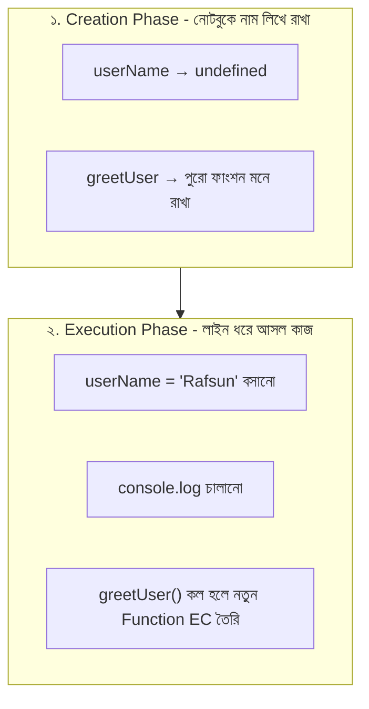
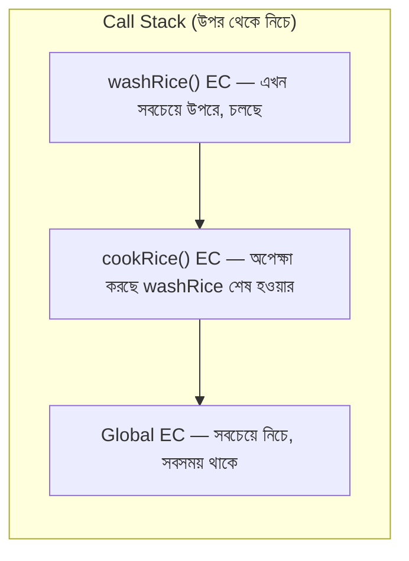
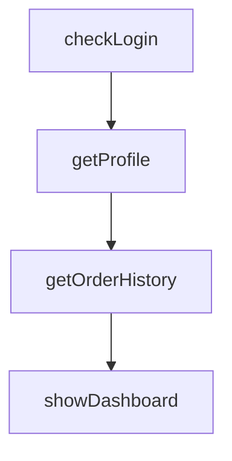
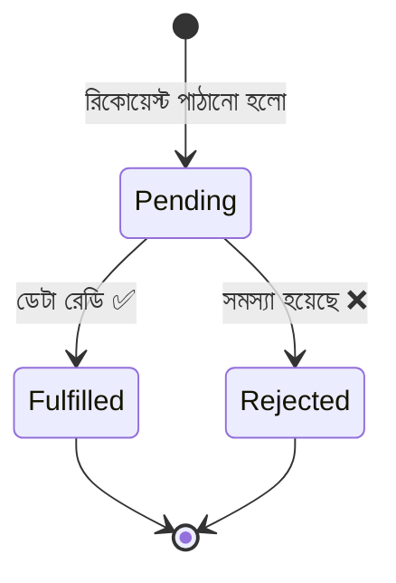
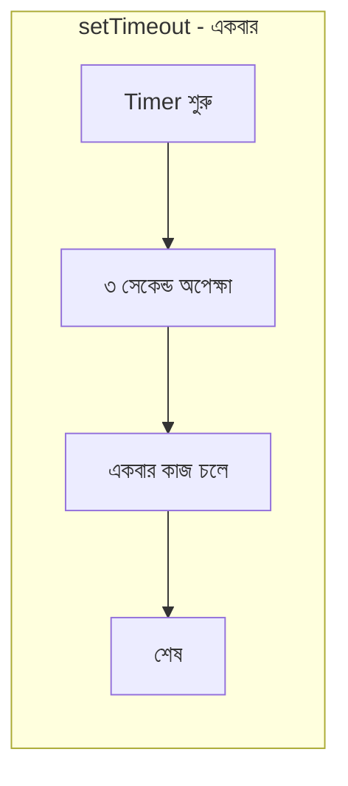
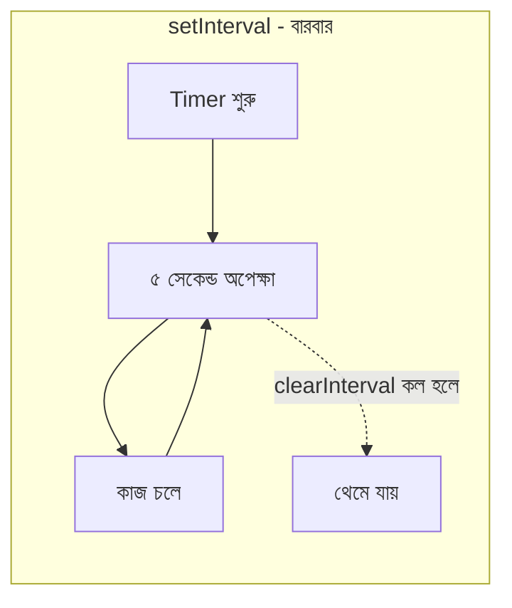
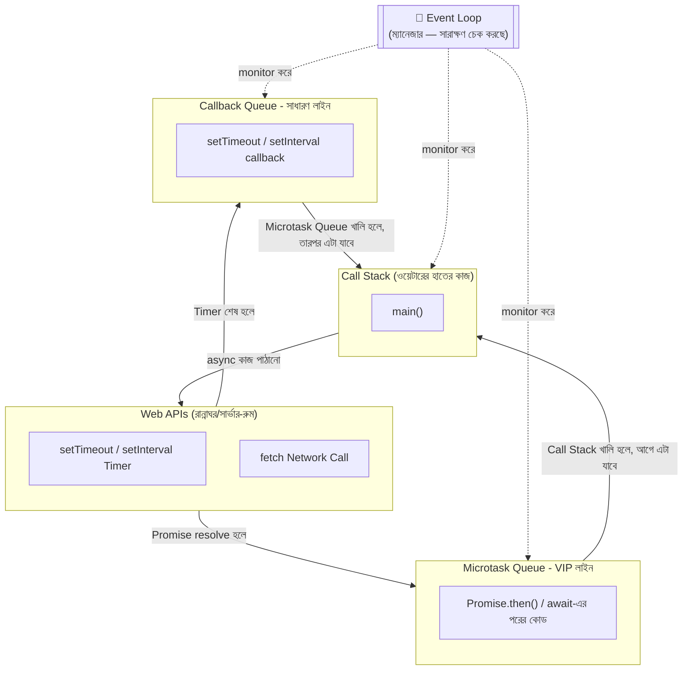
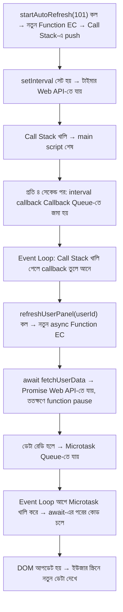
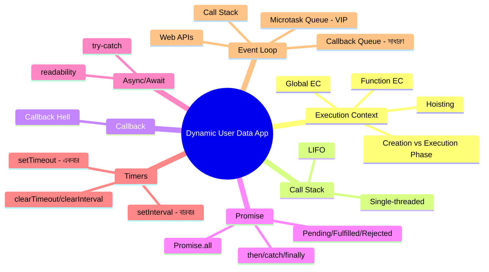

# 🍽️ Dynamic User Data App: রেস্টুরেন্টের গল্পে Code Flow বোঝা

> মডিউল: **[Foundation] এসিনক্রোনাস জাভাস্ক্রিপ্ট**
> টপিক: **Dynamic User Data App - Understanding Code Flow**
> কভার করা হচ্ছে: Execution Context | Event Loop | setTimeout and setInterval | Callback | Promise | Async/Await
>
> এই ডকুমেন্টটাও আগের রেস্টুরেন্টের গল্পের ধারাবাহিকতায় লেখা — যাতে concept গুলো মুখস্থ না হয়ে **মাথায় গেঁথে যায়**। যেখানে দরকার Mermaid diagram দেওয়া আছে visualize করার জন্য।

---

## 📚 সূচিপত্র (Table of Contents)

1. [ভূমিকা: আজকের গল্পটা কেন দরকার](#ভূমিকা-আজকের-গল্পটা-কেন-দরকার)
2. [Execution Context - ওয়েটারের কাজের নোটবুক](#১-execution-context---ওয়েটারের-কাজের-নোটবুক)
3. [Call Stack - নোটবুকের স্তূপ](#২-call-stack---নোটবুকের-স্তূপ)
4. [Callback - "কাজ শেষ হলে জানিও"](#৩-callback---কাজ-শেষ-হলে-জানিও)
5. [Promise - প্রতিশ্রুতির টোকেন](#৪-promise---প্রতিশ্রুতির-টোকেন)
6. [Async/Await - প্রতিশ্রুতিকে সহজ ভাষায় পড়া](#৫-asyncawait---প্রতিশ্রুতিকে-সহজ-ভাষায়-পড়া)
7. [setTimeout ও setInterval - রান্নাঘরের টাইমার](#৬-settimeout-ও-setinterval---রান্নাঘরের-টাইমার)
8. [Event Loop - সবকিছু জোড়া লাগানোর ম্যানেজার](#৭-event-loop---সবকিছু-জোড়া-লাগানোর-ম্যানেজার)
9. [সব একসাথে: Dynamic User Data App](#৮-সব-একসাথে-dynamic-user-data-app)
10. [সারসংক্ষেপ ও Practice আইডিয়া](#৯-সারসংক্ষেপ-ও-practice-আইডিয়া)

---

## ভূমিকা: আজকের গল্পটা কেন দরকার

আগের গল্পে আমরা শিখেছিলাম — JS হলো রেস্টুরেন্টের **ওয়েটার**, DOM হলো রেস্টুরেন্টের **map**, আর কিছু কাজ সাথে সাথে (sync) হয়, কিছু কাজ সময় নেয় (async)।

আজকের টপিক হলো — **"Dynamic User Data App"**। ধরুন আমরা এমন একটা অ্যাপ বানাচ্ছি, যেটা বারবার সার্ভার থেকে ইউজারের ডেটা (নাম, অর্ডার, নোটিফিকেশন) নিয়ে আসবে আর স্ক্রিনে আপডেট করবে। এই একটা অ্যাপের ভেতরেই লুকিয়ে আছে আজকের সবগুলো টপিক:

- ওয়েটার কীভাবে **নিজের কাজ মনে রাখে** কোন লাইনে আছে → **Execution Context**
- ওয়েটার একটার পর একটা কাজ কীভাবে **সাজিয়ে রাখে** হাতে → **Call Stack**
- ওয়েটার "কাজ শেষ হলে আমাকে জানিও" বলে কীভাবে রান্নাঘরে অর্ডার রেখে আসে → **Callback**
- ওয়েটার একটা **টোকেন** ধরিয়ে দেয় যেটা বলে দেয় খাবার রেডি হবে কি হবে না → **Promise**
- ওয়েটার সেই টোকেনটাকেই আরও **সহজ, সরল ভাষায়** পড়ে → **Async/Await**
- ম্যানেজার **নির্দিষ্ট সময় পরপর** বা **বারবার** কাউকে দিয়ে খোঁজ নেওয়ায় → **setTimeout ও setInterval**
- আর সবকিছু নিয়ন্ত্রণ করে যে একজন → **Event Loop**

চলুন একটা একটা করে বুঝি।

---

## ১. Execution Context - ওয়েটারের কাজের নোটবুক

### থিওরি

JavaScript engine যখন কোনো কোড রান করে, তখন সে একদম খালি হাতে রান করে না — প্রতিটা কোড রান করার আগে সে একটা **"কাজের পরিবেশ" (environment)** বানায়, যার নাম **Execution Context (EC)**। এই পরিবেশের ভেতরেই থাকে — কোন variable কী, কোন function কী, আর `this` মানে কী।

দুই ধরনের Execution Context হয়:

1. **Global Execution Context (GEC)** — প্রোগ্রাম শুরু হওয়া মাত্র, সবচেয়ে প্রথমে **একবারই** তৈরি হয়। এটা যেন রেস্টুরেন্ট খোলার সময় ম্যানেজার একটা **মূল খাতা (main notebook)** খুলে বসলো — যেখানে পুরো রেস্টুরেন্টের সব নিয়ম, মেনু, আর গ্লোবাল ভ্যারিয়েবল লেখা থাকবে।
2. **Function Execution Context (FEC)** — যতবার একটা function কল হয়, ততবার একটা করে **নতুন, ছোট নোটবুক** তৈরি হয়। কাজ শেষ হলে সেই নোটবুকটা ছুঁড়ে ফেলে দেওয়া হয় (memory থেকে মুছে যায়)।

### দুইটা ধাপ: Creation আর Execution

প্রতিটা Execution Context তৈরি হওয়ার সময় **দুইটা ধাপে** কাজ করে —

**ধাপ ১: Creation (Memory) Phase** — ওয়েটার নোটবুকের প্রথম পাতায় দ্রুত চোখ বুলিয়ে **সব variable আর function-এর নাম আগেই লিখে রাখে** (যদিও তখনো আসল মান/কাজ জানে না)। এই কারণেই —
- `var` দিয়ে ঘোষণা করা variable-এর জন্য মেমোরিতে জায়গা হয়ে যায়, মান বসে `undefined`।
- Function declaration (`function abc(){}`) পুরোপুরি মনে রাখা হয় — পুরো ফাংশনটাই।

এই ব্যাপারটাকেই বলে **Hoisting** — মনে হয় যেন variable আর function গুলো কোডের **উপরে তুলে আনা হয়েছে**, যদিও আসলে JS engine শুধু আগে থেকেই তাদের জায়গা বরাদ্দ করে রাখে।

**ধাপ ২: Execution Phase** — এবার ওয়েটার লাইন ধরে ধরে **আসল কাজ শুরু করে**, যেখানে variable-গুলোতে সত্যিকারের মান বসায়, আর একটার পর একটা লাইন চালায়।

```javascript
console.log(userName); // undefined (error না, কারণ hoisting-এ জায়গা হয়ে গেছে)
var userName = "Rafsun";
console.log(userName); // "Rafsun"

greetUser(); // এটা কাজ করবে, কারণ function পুরোপুরি hoist হয়

function greetUser() {
  console.log("স্বাগতম, " + userName);
}
```



> **মনে রাখুন:** `let` আর `const`-ও hoist হয়, কিন্তু তারা একটা "Temporal Dead Zone (TDZ)"-এ থাকে — মানে declare হওয়ার আগে access করতে গেলে error দেয়, `undefined` না। এটাই `var` আর `let/const`-এর মধ্যে মূল পার্থক্য এই প্রসঙ্গে।

---

## ২. Call Stack - নোটবুকের স্তূপ

ওয়েটার একসাথে অনেক নোটবুক নিয়ে কাজ করলেও, **এক মুহূর্তে হাতে শুধু একটাই নোটবুক খোলা থাকে** — এটাই বোঝায় JavaScript **single-threaded**। বাকি নোটবুকগুলো একটার উপর একটা করে **স্তূপ (stack)** আকারে জমা হয়ে থাকে, একদম নিচে থাকে Global EC।

এই স্তূপটাই **Call Stack**। নিয়ম হলো **LIFO (Last In, First Out)** — সবার শেষে যেই নোটবুক উপরে রাখা হয়েছে, কাজ শেষ হলে সেটাই সবার আগে সরে যায়।

```javascript
function washRice() {
  console.log("চাল ধোয়া হচ্ছে");
}

function cookRice() {
  washRice();
  console.log("রান্না হচ্ছে");
}

cookRice();
```



**যা ঘটে ধাপে ধাপে:**
1. `cookRice()` কল হলো → তার Function EC স্তূপে (push) বসলো, Global EC-এর উপরে।
2. `cookRice()`-এর ভেতর `washRice()` কল হলো → তার EC আরও উপরে push হলো।
3. `washRice()`-এর কাজ শেষ → তার EC স্তূপ থেকে সরে গেলো (pop)।
4. এবার `cookRice()`-এর বাকি লাইন চলে, শেষ হলে তারও EC pop হয়ে যায়।

এই Call Stack-টাই পরে **Event Loop** বোঝার জন্য সবচেয়ে গুরুত্বপূর্ণ ভিত্তি — কারণ "Call Stack খালি কিনা" এটাই ঠিক করে পরবর্তী কোন কাজটা চলবে।

---

## ৩. Callback - "কাজ শেষ হলে জানিও"

**Callback** হলো এমন একটা ফাংশন, যেটাকে অন্য একটা ফাংশনের **আর্গুমেন্ট হিসেবে পাঠানো হয়**, আর নির্দিষ্ট কাজ শেষ হলে সেটাকে **"ফিরে ডাকা" (call back)** হয়।

আমাদের Dynamic User Data App-এর প্রসঙ্গে ভাবুন — ওয়েটার সার্ভারের কাছে ইউজারের ডেটা চাইলো, আর বলে রাখলো, *"ডেটা পেলে এই কাজটা করো"*।

```javascript
function fetchUserData(userId, callback) {
  console.log(userId + " নম্বর ইউজারের ডেটা আনা হচ্ছে...");

  setTimeout(function () {
    const userData = { id: userId, name: "Rafsun Jani" };
    callback(userData); // ডেটা রেডি হলে ওয়েটারকে জানানো
  }, 1500);
}

fetchUserData(101, function (data) {
  console.log("ইউজার পাওয়া গেছে:", data.name);
});
```

কয়েক ধাপ dependent কাজ (যেমন: **আগে লগইন চেক করো → তারপর প্রোফাইল আনো → তারপর অর্ডার হিস্ট্রি আনো**) একসাথে callback দিয়ে লিখলে কোডটা সিঁড়ির মতো ডানদিকে নেমে যায় — এটাই **Callback Hell**। এই সমস্যার সমাধান হিসেবেই এলো **Promise**।



---

## ৪. Promise - প্রতিশ্রুতির টোকেন

ওয়েটার সার্ভারের কাছে ডেটা চাইলো। সার্ভার সাথে সাথে একটা **টোকেন** ধরিয়ে দিলো, যাতে লেখা: *"তোমার ডেটা প্রসেস হচ্ছে, রেডি হলে জানানো হবে।"* এই টোকেনটাই **Promise**।

টোকেনের ৩টা অবস্থা (state) থাকে —

1. **Pending** — এখনো ডেটা আনা হচ্ছে
2. **Fulfilled** — ডেটা রেডি, সফলভাবে পাওয়া গেছে ✅
3. **Rejected** — সমস্যা হয়েছে, ডেটা আনা যায়নি ❌



```javascript
function fetchUserData(userId) {
  return new Promise(function (resolve, reject) {
    setTimeout(function () {
      const isOnline = Math.random() > 0.2; // ৮০% সফল হওয়ার সম্ভাবনা

      if (isOnline) {
        resolve({ id: userId, name: "Rafsun Jani" });
      } else {
        reject("সার্ভারের সাথে সংযোগ করা যায়নি!");
      }
    }, 1500);
  });
}

fetchUserData(101)
  .then(function (user) {
    console.log("✅ ইউজার পাওয়া গেছে:", user.name);
  })
  .catch(function (error) {
    console.log("❌ সমস্যা:", error);
  })
  .finally(function () {
    console.log("রিকোয়েস্ট প্রসেস শেষ।");
  });
```

**Chaining** করলে dependent কাজগুলোও এখন সোজা লাইনে পড়া যায়, সিঁড়ির মতো নামতে হয় না —

```javascript
checkLogin()
  .then(() => getProfile())
  .then((profile) => getOrderHistory(profile.id))
  .then((orders) => console.log("অর্ডার হিস্ট্রি:", orders))
  .catch((error) => console.log("কোথাও সমস্যা হয়েছে:", error));
```

আর `Promise.all()` দিয়ে একসাথে **একাধিক ইউজারের ডেটা** একবারে আনা যায়, সবগুলো রেডি হলেই একসাথে দেখানো হবে —

```javascript
Promise.all([
  fetchUserData(101),
  fetchUserData(102),
  fetchUserData(103),
]).then((allUsers) => {
  console.log("সবার ডেটা একসাথে পাওয়া গেছে:", allUsers);
});
```

---

## ৫. Async/Await - প্রতিশ্রুতিকে সহজ ভাষায় পড়া

`.then().then()` চেইনও মাঝে মাঝে একটু জটিল লাগে। তাই এলো **`async/await`** — Promise-কেই **সাধারণ, উপর থেকে নিচে পড়া যায় এমন ভাষায়** লেখার একটা সুন্দর মোড়ক (syntactic sugar)।

`await` মানে ওয়েটার বলছে — *"আমি এখানেই দাঁড়িয়ে অপেক্ষা করবো, যতক্ষণ না এই নির্দিষ্ট ডেটাটা রেডি হয়, কিন্তু রেস্টুরেন্টের বাকি সব কাজ ঠিকই চলতে থাকবে"* — কারণ `await` শুধু নির্দিষ্ট `async` ফাংশনের ভেতরের পরের লাইনে যাওয়া আটকায়, পুরো প্রোগ্রামকে না।

```javascript
async function loadUserDashboard(userId) {
  try {
    const user = await fetchUserData(userId);
    console.log("✅ ইউজার:", user.name);

    const orders = await getOrderHistory(user.id);
    console.log("✅ অর্ডার হিস্ট্রি:", orders);
  } catch (error) {
    console.log("❌ সমস্যা:", error);
  }
}

loadUserDashboard(101);
```

> **মনে রাখার নিয়ম:** `await` শুধু `async` ফাংশনের ভেতরেই ব্যবহার করা যায়। Error handle করার জন্য `try...catch` ব্যবহার হয়, `.catch()`-এর বদলে।

---

## ৬. setTimeout ও setInterval - রান্নাঘরের টাইমার

এতক্ষণ আমরা দেখলাম ডেটা **কীভাবে** আনা হয় (callback/promise/async-await দিয়ে)। এবার দেখি ডেটা আনার কাজটা **কখন** এবং **কতবার** চালানো হবে — সেটা নিয়ন্ত্রণ করে `setTimeout` আর `setInterval`।

### setTimeout - "একবার, নির্দিষ্ট সময় পর"

ম্যানেজার ওয়েটারকে বলল — *"৩ সেকেন্ড পর একবার গিয়ে টেবিল ৫-এ চেক করে এসো"*। এটাই `setTimeout` — একবার, নির্দিষ্ট সময় পর, একটামাত্র কাজ চালায়।

```javascript
console.log("অপেক্ষা শুরু...");

const timerId = setTimeout(function () {
  console.log("৩ সেকেন্ড পর একবার এই কাজটা চলবে");
}, 3000);

// যদি দরকার না হয়, আগেই বাতিল করা যায়
// clearTimeout(timerId);
```

### setInterval - "প্রতি নির্দিষ্ট সময় পরপর, বারবার"

ম্যানেজার এবার বলল — *"যতক্ষণ না আমি না বলছি, প্রতি ৫ সেকেন্ড পরপর গিয়ে ইউজারের নতুন নোটিফিকেশন আছে কিনা চেক করে এসো"*। এটাই `setInterval` — বারবার, নির্দিষ্ট বিরতিতে, না থামানো পর্যন্ত চলতেই থাকে।

```javascript
let checkCount = 0;

const intervalId = setInterval(function () {
  checkCount++;
  console.log("নতুন নোটিফিকেশন চেক করা হচ্ছে... (" + checkCount + " বার)");

  if (checkCount === 5) {
    clearInterval(intervalId); // ৫ বার চেক করার পর থামিয়ে দিলাম
    console.log("চেক করা বন্ধ করা হলো।");
  }
}, 5000);
```

### দুইটার পার্থক্য এক নজরে

| বিষয় | `setTimeout` | `setInterval` |
|---|---|---|
| কতবার চলে | **একবার** | **বারবার**, না থামানো পর্যন্ত |
| বাতিল করা হয় | `clearTimeout(id)` | `clearInterval(id)` |
| রেস্টুরেন্টের উদাহরণ | "৩ সেকেন্ড পর একবার চেক করো" | "প্রতি ৫ সেকেন্ড পরপর চেক করতে থাকো" |
| Dynamic App-এ ব্যবহার | Debounced search (টাইপ থামার পর খোঁজা) | Auto-refresh (প্রতি কিছুক্ষণ পরপর ডেটা রিফ্রেশ) |





⚠️ **গুরুত্বপূর্ণ:** `setTimeout(fn, 0)` দিলেও `fn` **সাথে সাথে** চলে না — কারণ সে সরাসরি Call Stack-এ যায় না, আগে Web API-তে গিয়ে তারপর একটা লাইনে (Queue-তে) অপেক্ষা করে। এই কারণটাই এবার Event Loop দিয়ে বুঝবো।

---

## ৭. Event Loop - সবকিছু জোড়া লাগানোর ম্যানেজার

প্রশ্ন হলো — JavaScript যেহেতু **single-threaded** (একসাথে একটাই নোটবুক হাতে থাকে — Call Stack মনে করুন), তাহলে সে কীভাবে একই সাথে timer, Promise, আর network request — সব সামলায়? উত্তর: **Event Loop**।

### অংশগুলো চিনে নিই

- **Call Stack** = ওয়েটার এখন যে কাজটা হাতে নিয়ে করছে (উপরের অংশে যেটা দেখলাম)
- **Web APIs** = রান্নাঘর/সার্ভার-রুম, যেখানে সময়সাপেক্ষ কাজ (timer, `fetch`) ব্যাকগ্রাউন্ডে চলে
- **Callback Queue (Macrotask Queue)** = সাধারণ লাইন, যেখানে `setTimeout`/`setInterval`-এর কাজ শেষ হয়ে সার্ভ হওয়ার অপেক্ষায় থাকে
- **Microtask Queue** = **VIP লাইন** — Promise-এর `.then()`/`.catch()`/`await`-এর পরের কোড এখানে অপেক্ষা করে, আর এটা সবসময় Callback Queue-এর **আগে** সার্ভ হয়
- **Event Loop** = ম্যানেজার, যে সারাক্ষণ চেক করে — *"Call Stack কি খালি? তাহলে আগে VIP (Microtask) লাইন থেকে, তারপর সাধারণ (Callback) লাইন থেকে পরের কাজ নিয়ে আসি।"*



### Execution Order উদাহরণ দিয়ে বুঝি

```javascript
console.log("১. অ্যাপ শুরু");

setTimeout(() => {
  console.log("৪. Timer শেষ (Callback Queue)");
}, 0);

fetchUserData(101).then(() => {
  console.log("৩. ডেটা এসেছে (Microtask Queue)");
});

console.log("২. অ্যাপ initialize শেষ");
```

**আউটপুট হবে:**
```
১. অ্যাপ শুরু
২. অ্যাপ initialize শেষ
৩. ডেটা এসেছে (Microtask Queue)
৪. Timer শেষ (Callback Queue)
```

**কেন এমন হলো?**
1. প্রথমে সব **synchronous** লাইন সরাসরি Call Stack-এ চলে (১ আর ২)।
2. `setTimeout`-এর delay `0ms` দিলেও, সে সরাসরি Call Stack-এ যায় না — আগে Web API, তারপর Callback Queue-তে অপেক্ষা করে।
3. Promise-এর `.then()` যায় **Microtask Queue**-তে, যেটা Callback Queue-এর চেয়ে **অগ্রাধিকার** পায়।
4. Event Loop আগে Call Stack খালি করে, তারপর Microtask Queue পুরোপুরি খালি করে, **তারপরই** Callback Queue থেকে একটা করে কাজ নেয়।

এই জন্যই Promise-ভিত্তিক কাজ (৩), Timer-ভিত্তিক কাজের (৪) **আগে** রান হলো — যদিও Timer-এ `0ms` দেওয়া হয়েছিলো।

---

## ৮. সব একসাথে: Dynamic User Data App

এখন চলুন পুরো টপিকটাকে একসাথে জোড়া লাগাই — একটা ছোট **Dynamic User Data App** যেটা প্রতি কিছুক্ষণ পরপর সার্ভার থেকে ইউজারের ডেটা রিফ্রেশ করে দেখাবে।

```javascript
// ১. Global Execution Context তৈরি হয়, এই ভ্যারিয়েবলগুলো hoist হয়ে যায়
let refreshCount = 0;
let refreshTimerId = null;

// ২. Promise ব্যবহার করে ডেটা আনার ফাংশন
function fetchUserData(userId) {
  return new Promise(function (resolve, reject) {
    setTimeout(function () {
      const success = Math.random() > 0.15;
      if (success) {
        resolve({ id: userId, name: "Rafsun Jani", lastActive: new Date().toLocaleTimeString() });
      } else {
        reject("সার্ভার সাড়া দিচ্ছে না");
      }
    }, 800);
  });
}

// ৩. Async/Await দিয়ে DOM আপডেট করা - প্রতিবার কল হলে একটা নতুন Function EC তৈরি হয়
async function refreshUserPanel(userId) {
  try {
    const user = await fetchUserData(userId);
    document.querySelector("#user-name").textContent = user.name;
    document.querySelector("#last-active").textContent = "সবশেষ সক্রিয়: " + user.lastActive;
  } catch (error) {
    console.log("❌ রিফ্রেশ ব্যর্থ:", error);
  }
}

// ৪. setInterval দিয়ে প্রতি ৪ সেকেন্ড পরপর অটো-রিফ্রেশ
function startAutoRefresh(userId) {
  refreshTimerId = setInterval(function () {
    refreshCount++;
    refreshUserPanel(userId);

    if (refreshCount === 10) {
      clearInterval(refreshTimerId); // ১০ বার রিফ্রেশের পর থামিয়ে দেওয়া
      console.log("অটো-রিফ্রেশ বন্ধ করা হলো।");
    }
  }, 4000);
}

startAutoRefresh(101);
```

**এই একটা কোডেই কী কী ঘটছে, ধাপে ধাপে:**



### WordPress/PHP প্রসঙ্গে

আপনি যেহেতু মূলত **WordPress/WooCommerce**-এর সাথে কাজ করেন, এই একই প্যাটার্ন আপনি ব্যবহার করবেন যখন **WordPress REST API** বা **AJAX (`wp_ajax_`)** endpoint থেকে বারবার ডেটা টানতে হবে —

```javascript
async function refreshWooOrderStatus(orderId) {
  try {
    const res = await fetch(`/wp-json/wc/store/v1/orders/${orderId}`);
    if (!res.ok) throw new Error("Server error: " + res.status);

    const order = await res.json();
    document.querySelector("#order-status").textContent = order.status;
  } catch (err) {
    console.error("অর্ডার স্ট্যাটাস লোড করতে সমস্যা:", err);
  }
}

// প্রতি ১০ সেকেন্ড পরপর অর্ডার স্ট্যাটাস চেক (যেমন: কাস্টমার অর্ডার ট্র্যাকিং পেজে)
const orderStatusTimer = setInterval(() => refreshWooOrderStatus(452), 10000);

// পেজ ছেড়ে চলে গেলে টাইমার বন্ধ করে দেওয়া (ভালো practice)
window.addEventListener("beforeunload", () => clearInterval(orderStatusTimer));
```

---

## ৯. সারসংক্ষেপ ও Practice আইডিয়া

### পুরো গল্পের সারমর্ম



### Practice-এর জন্য আইডিয়া (আপনার জন্য suggest করছি)

যেহেতু এটাও Git-এ আপলোড হবে, নিচের ছোট প্র্যাকটিস আইডিয়াগুলো আগের `dom-and-async-js-notes` repo-র সাথেই যোগ করতে পারেন —

1. **Auto-Refreshing Dashboard** — উপরের `refreshUserPanel` উদাহরণটাকে বাস্তব একটা mock JSON API (যেমন `jsonplaceholder.typicode.com`) দিয়ে বানিয়ে ফেলা।
2. **setInterval vs setTimeout তুলনা** — একটা বাটনে ক্লিক করলে `setInterval` চালু হবে, আরেকটাতে `clearInterval` দিয়ে বন্ধ হবে — কাউন্টার দেখিয়ে পার্থক্যটা visually বোঝা।
3. **Execution Order Quiz স্ক্রিপ্ট** — `console.log`, `setTimeout`, আর `Promise.then()` মিশিয়ে ৫-৬টা লাইনের একটা স্ক্রিপ্ট বানিয়ে, রান করার আগে কাগজে predict করা আউটপুট কী হবে, তারপর মিলিয়ে দেখা।
4. **WooCommerce Order Tracker** — আপনার WordPress ব্যাকগ্রাউন্ডের সাথে মিলিয়ে, `setInterval` দিয়ে প্রতি কিছু সেকেন্ড পরপর অর্ডার স্ট্যাটাস চেক করা একটা ছোট widget বানানো।

---

## 📌 GitHub README-এ যেভাবে সাজাতে পারেন

আগের `dom-and-async-js-notes` repo-র মতোই, এই ফাইলটাও সরাসরি `.md` হিসেবে রাখতে পারবেন — উপরের Table of Contents-এর লিংক আর সব Mermaid diagram GitHub natively render করবে, কোনো extra সেটআপ ছাড়াই।

```
📦 dom-and-async-js-notes
 ┣ 📜 README.md                              ← আগের DOM + Async ফাইল
 ┣ 📜 execution-context-and-event-loop.md    ← এই ফাইলটা
 ┣ 📂 todo-app-bad-way/
 ┣ 📂 todo-app-good-way/
 ┗ 📂 async-examples/
   ┣ 📜 callback-example.js
   ┣ 📜 promise-example.js
   ┣ 📜 async-await-example.js
   ┗ 📜 dynamic-user-data-app.js             ← আজকের combined উদাহরণ
```
