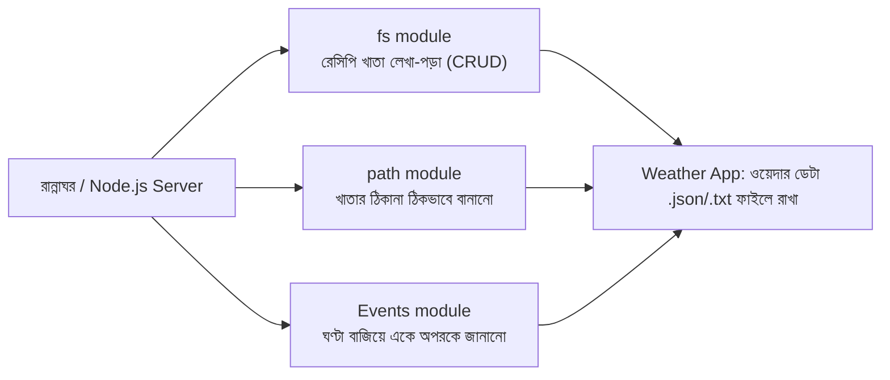
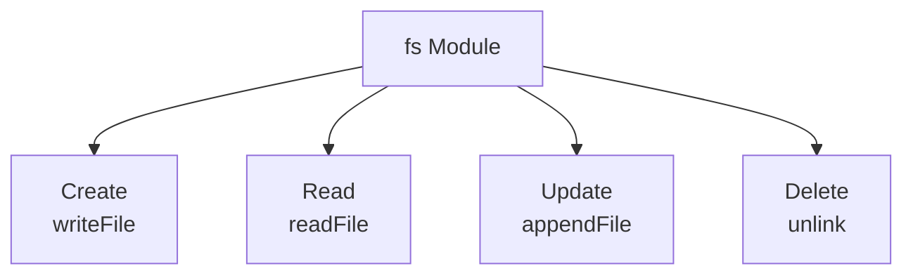
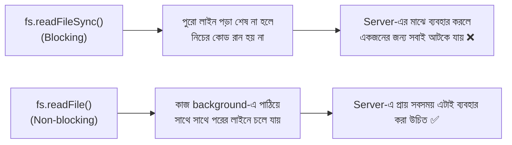
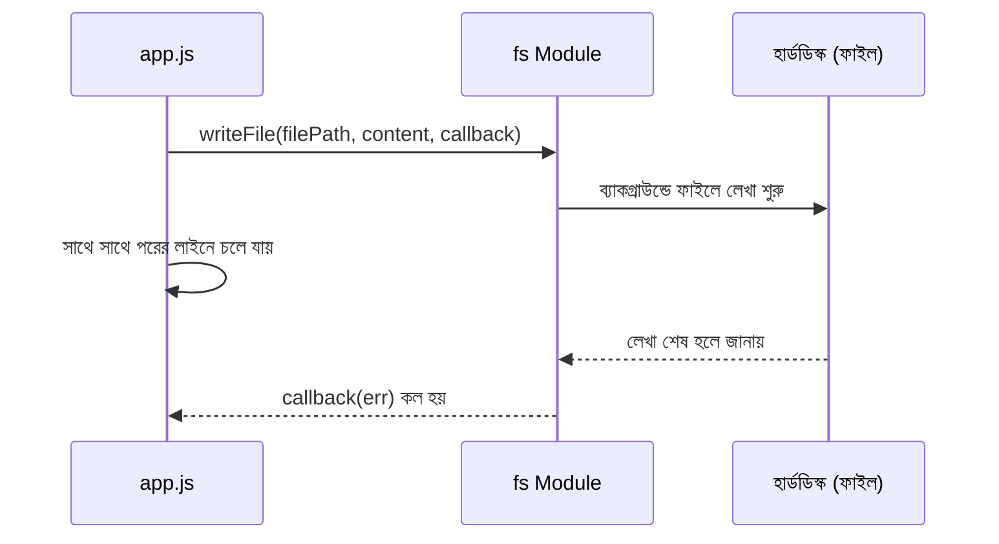
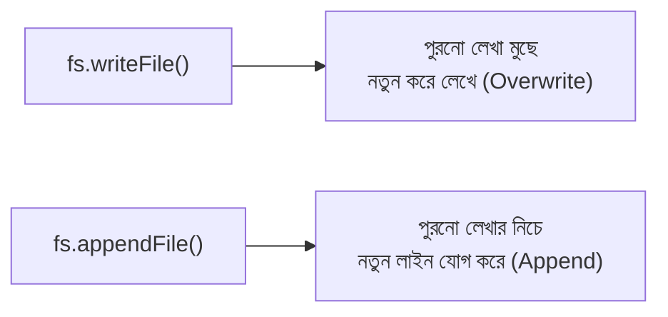
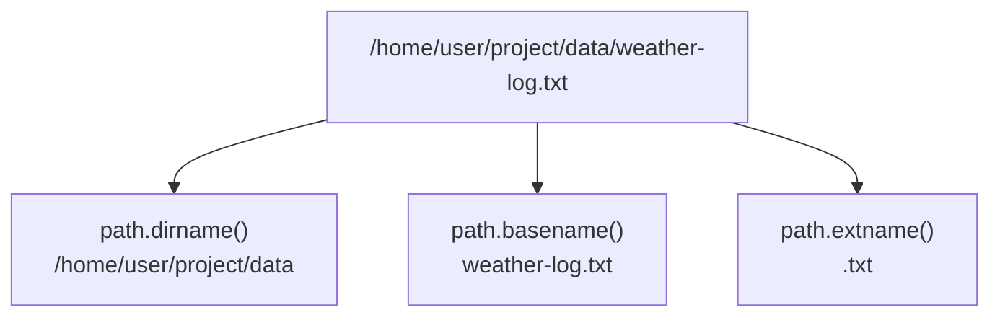
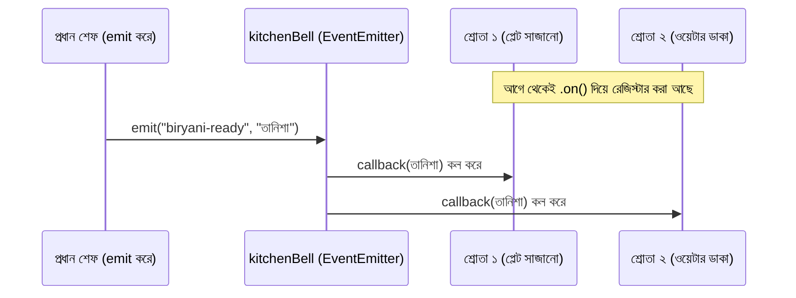
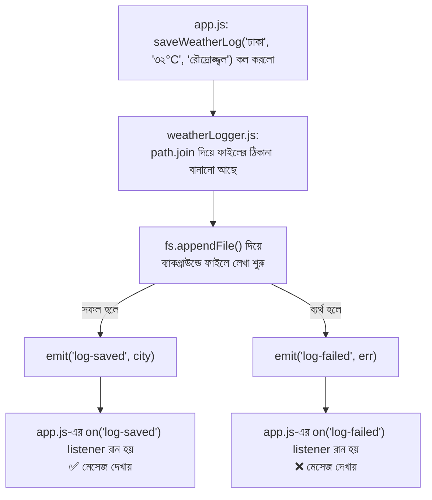
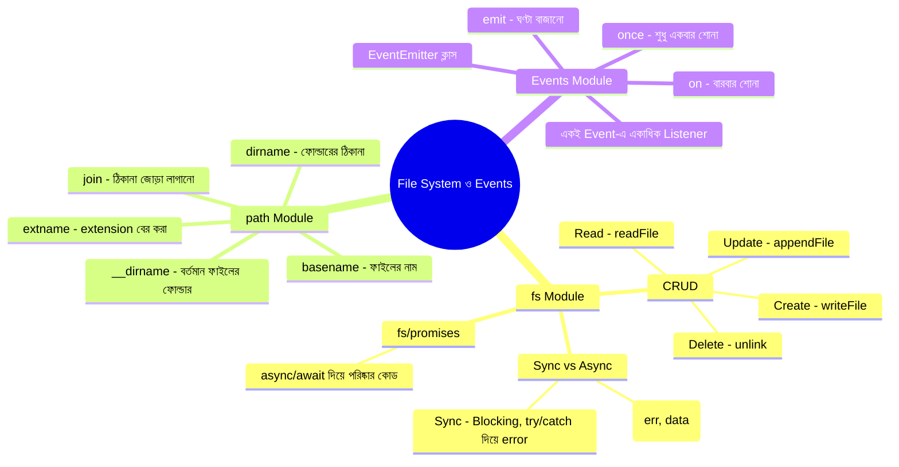

# 🍳 রেস্টুরেন্টের রান্নাঘর: রেসিপির খাতা (File System) আর রান্নাঘরের ঘণ্টা (Events)

> এই ডকুমেন্টটাও আগের ফাইলগুলোর মতোই **গল্প আকারে** লেখা, যাতে concept গুলো মুখস্থ না হয়ে মাথায় গেঁথে যায়। আগের গল্পে আমরা দেখেছিলাম, Node.js হলো রান্নাঘরের প্রধান শেফ, আর `http`/`url` module দিয়ে সে বাইরের কাস্টমারের অর্ডার (Request) নেয়। এবার আমরা দেখবো, শেফ কীভাবে **রেসিপির খাতায় (File)** লিখে-পড়ে রাখে, আর রান্নাঘরে কোনো ঘটনা ঘটলে (যেমন — খাবার রেডি) কীভাবে **ঘণ্টা বাজিয়ে (Event)** সবাইকে জানায়।

---

## 📚 সূচিপত্র (Table of Contents)

1. [ভূমিকা: রেসিপির খাতা আর রান্নাঘরের ঘণ্টা](#ভূমিকা-রেসিপির-খাতা-আর-রান্নাঘরের-ঘণ্টা)
2. [fs (File System) Module কী](#১-fs-file-system-module-কী)
3. [Sync vs Async — খাতার সাথে কাজ করার দুই ধরন](#২-sync-vs-async--খাতার-সাথে-কাজ-করার-দুই-ধরন)
4. [CREATE — নতুন রেসিপি খাতা লেখা](#৩-create--নতুন-রেসিপি-খাতা-লেখা)
5. [READ — পুরনো রেসিপি খাতা পড়া](#৪-read--পুরনো-রেসিপি-খাতা-পড়া)
6. [UPDATE — খাতায় নতুন লাইন যোগ করা](#৫-update--খাতায়-নতুন-লাইন-যোগ-করা)
7. [DELETE — খাতা ছিঁড়ে ফেলা](#৬-delete--খাতা-ছিঁড়ে-ফেলা)
8. [বোনাস: fs.promises দিয়ে আধুনিক async/await পদ্ধতি](#৭-বোনাস-fspromises-দিয়ে-আধুনিক-asyncawait-পদ্ধতি)
9. [path Module — ঠিকানা লেখার নিয়ম](#৮-path-module--ঠিকানা-লেখার-নিয়ম)
10. [Event Module — রান্নাঘরের ঘণ্টা সিস্টেম](#৯-event-module--রান্নাঘরের-ঘণ্টা-সিস্টেম)
11. [সব মিলিয়ে: Weather App-এ fs + path + Events](#১০-সব-মিলিয়ে-weather-app-এ-fs--path--events)
12. [সারসংক্ষেপ ও Practice আইডিয়া](#১১-সারসংক্ষেপ-ও-practice-আইডিয়া)
13. [GitHub-এ যেভাবে রাখতে পারেন](#-github-এ-যেভাবে-রাখতে-পারেন)

---

## ভূমিকা: রেসিপির খাতা আর রান্নাঘরের ঘণ্টা

আগের গল্পে আমরা শিখেছিলাম, রান্নাঘরের (Server-এর) দরজা দিয়ে কাস্টমার অর্ডার পাঠায় (`http`), আর সেই অর্ডারের ঠিকানা বোঝা যায় `url` module দিয়ে। কিন্তু একটা জিনিস বাকি ছিলো — শেফ যে রেসিপিগুলো ব্যবহার করে, সেগুলো **কোথায় জমা থাকে**? আর শেফের হাতে যদি অনেক সহকারী থাকে, তারা একে অপরকে কীভাবে জানায় যে "এই কাজটা শেষ হয়ে গেছে, তুমি এখন তোমার কাজ শুরু করো"?

এই দুইটা প্রশ্নের উত্তর দেয় আজকের দুইটা টুল:

- **`fs` (File System) Module** — এটা রান্নাঘরের সেই **রেসিপির খাতা রাখার আলমারি**। এখান থেকে শেফ নতুন খাতা বানাতে পারে (Create), পুরনো খাতা পড়তে পারে (Read), খাতায় নতুন কিছু যোগ করতে পারে (Update), আবার পুরনো খাতা ফেলেও দিতে পারে (Delete)। এই চারটা কাজকে একসাথে বলা হয় **CRUD**।
- **Event Module** — এটা রান্নাঘরের **ঘণ্টা সিস্টেম**। শেফ একটা ঘণ্টা টাঙিয়ে রাখে (`EventEmitter`), আর যখনই একটা নির্দিষ্ট ঘটনা ঘটে (যেমন, বিরিয়ানি রেডি), তখন সে ঘণ্টা বাজায় (`emit`)। রান্নাঘরের যে সহকারীরা সেই ঘণ্টার শব্দ শোনার জন্য কান পেতে বসে ছিলো (`on`), তারা সাথে সাথে কাজে লেগে যায়।

এই দুইটা জিনিসকে এক জায়গায় বাঁধতে সাহায্য করে **`path` module** — এটা হলো রান্নাঘরের **ঠিকানা লেখার নিয়ম বই**, যেটা দিয়ে বোঝা যায় কোন খাতাটা কোন তাকে, কোন ফোল্ডারে রাখা আছে — যাতে Windows/Mac/Linux যেকোনো কম্পিউটারেই ঠিকানাটা সঠিকভাবে কাজ করে।



চলুন একটা একটা করে দেখি।

---

## ১. fs (File System) Module কী

`fs` হলো Node.js-এর একটা **Core/Built-in Module** — মানে এটা আলাদা করে ইনস্টল করা লাগে না, শুধু `require` করলেই হয়। এটা ব্যবহার করে শেফ কম্পিউটারের হার্ডডিস্কে থাকা **যেকোনো ফাইল** নিয়ে কাজ করতে পারে — পড়া, লেখা, বদলানো, মুছে ফেলা।

```javascript
const fs = require("fs"); // fs = File System — বিল্ট-ইন module, তাই ./  লাগেনি
```

মনে আছে, আগের ফাইলে বলেছিলাম — **Browser-এ File System access নেই (নিরাপত্তার কারণে)**, কিন্তু Node.js-এ আছে। এই `fs` module-টাই সেই ক্ষমতাটা দেয়। এই কারণেই Node.js দিয়ে ব্যাকএন্ডে ফাইল আপলোড, লগ লেখা, JSON ডেটা সেভ করার মতো কাজ করা যায়।

`fs` module-এর মূল কাজগুলোকে যদি রেস্টুরেন্টের ভাষায় সাজাই, তাহলে হয় **CRUD**:

| CRUD | রেস্টুরেন্টের ভাষায় | fs-এর ফাংশন (Async) | fs-এর ফাংশন (Sync) |
|---|---|---|---|
| **C**reate | নতুন খাতা বানানো | `fs.writeFile()` | `fs.writeFileSync()` |
| **R**ead | খাতা পড়া | `fs.readFile()` | `fs.readFileSync()` |
| **U**pdate | খাতায় নতুন লাইন যোগ করা | `fs.appendFile()` | `fs.appendFileSync()` |
| **D**elete | খাতা ছিঁড়ে ফেলা | `fs.unlink()` | `fs.unlinkSync()` |



---

## ২. Sync vs Async — খাতার সাথে কাজ করার দুই ধরন

আগের ফাইলে আমরা শিখেছিলাম Blocking (Sync) আর Non-blocking (Async) কী। `fs` module-এর প্রায় **প্রতিটা ফাংশনেরই দুইটা ভার্সন আছে** — একটা Sync (নামের শেষে `Sync` লেখা থাকে), আরেকটা Async (সাধারণ নাম, কিন্তু একটা callback function নেয়)।

- **Sync ভার্সন (`readFileSync`)** — শেফ খাতাটা পড়া শেষ না করা পর্যন্ত **হাত নড়ায় না**, রান্নাঘরের বাকি সব কাজ থেমে থাকে। ছোট script বা Server চালু হওয়ার আগে (startup) এটা ব্যবহার করা নিরাপদ, কিন্তু চলমান Server-এর মাঝে এটা ব্যবহার করলে অন্য সব কাস্টমার (Request) আটকে যায়।
- **Async ভার্সন (`readFile`)** — শেফ খাতা পড়ার কাজটা background-এ (libuv সহকারীদের হাতে) দিয়ে দেয়, নিজে সাথে সাথে পরের কাজে চলে যায়। খাতা পড়া শেষ হলে callback function-টা কল হয়ে ফলাফল জানায়।



> **নিয়ম:** যেহেতু Weather App-টা একটা Server, তাই আমরা মূলত **Async ভার্সন** ব্যবহার করবো (`readFile`, `writeFile`)। `Sync` ভার্সনগুলো শুধু বুঝার সুবিধার জন্য পাশাপাশি দেখাচ্ছি।

---

## ৩. CREATE — নতুন রেসিপি খাতা লেখা

`fs.writeFile()` দিয়ে শেফ একদম নতুন একটা খাতা বানায়, অথবা যদি সেই নামের খাতা আগে থেকেই থাকে, তাহলে তার **পুরনো লেখা মুছে নতুন করে লিখে দেয় (overwrite)**।

### Async ভার্সন

```javascript
const fs = require("fs");

// filePath = কোন খাতায় (ফাইলে) লেখা হবে তার নাম
const filePath = "weather-log.txt";

// content = খাতায় কী লেখা হবে
const content = "ঢাকা: ৩২°C, রৌদ্রোজ্জ্বল\n";

// fs.writeFile(কোন ফাইলে, কী লেখা হবে, callback)
fs.writeFile(filePath, content, (err) => {
  // err = যদি লিখতে গিয়ে কোনো সমস্যা (Error) হয়, সেটা এখানে চলে আসে
  if (err) {
    console.log("খাতা লিখতে সমস্যা হলো:", err);
    return;
  }
  console.log("নতুন রেসিপি খাতা লেখা হয়ে গেছে ✅");
});

console.log("খাতা লেখা background-এ শুরু হলো, আমি পরের কাজে চলে গেলাম...");
```

**আউটপুট ক্রম:** প্রথমে "খাতা লেখা background-এ শুরু হলো..." প্রিন্ট হবে, তারপর ফাইলে লেখা শেষ হলে "নতুন রেসিপি খাতা লেখা হয়ে গেছে ✅" প্রিন্ট হবে — কারণ এটা **Non-blocking**।

### Sync ভার্সন (তুলনার জন্য)

```javascript
const fs = require("fs");

const filePath = "weather-log.txt"; // ফাইলের নাম
const content = "ঢাকা: ৩২°C, রৌদ্রোজ্জ্বল\n"; // কী লেখা হবে

// এই লাইনটা শেষ না হওয়া পর্যন্ত নিচের কোড রান হবে না
fs.writeFileSync(filePath, content);

console.log("এইবার লেখা শেষ হওয়ার পরেই এই লাইনটা প্রিন্ট হলো");
```



---

## ৪. READ — পুরনো রেসিপি খাতা পড়া

`fs.readFile()` দিয়ে শেফ আলমারি থেকে খাতা বের করে পড়ে।

```javascript
const fs = require("fs");

const filePath = "weather-log.txt"; // কোন ফাইল পড়া হবে
const encoding = "utf-8"; // encoding = ফাইলের লেখাগুলো কীভাবে ডিকোড করে টেক্সট বানাবে (utf-8 = সাধারণ টেক্সট ফাইলের জন্য)

fs.readFile(filePath, encoding, (err, data) => {
  // err = ফাইল পড়তে সমস্যা হলে (যেমন ফাইলটাই খুঁজে পাওয়া গেলো না)
  // data = ফাইলের ভেতরের আসল লেখা (successful হলে)
  if (err) {
    console.log("খাতা পড়তে সমস্যা হলো:", err);
    return;
  }
  console.log("খাতায় যা লেখা আছে:\n", data);
});
```

### Sync ভার্সন

```javascript
const fs = require("fs");

try {
  // fs.readFileSync ফাইলের কনটেন্ট সরাসরি রিটার্ন করে (callback লাগে না)
  const data = fs.readFileSync("weather-log.txt", "utf-8");
  console.log("খাতায় যা লেখা আছে:\n", data);
} catch (err) {
  // Sync ভার্সনে error ধরতে try/catch ব্যবহার করা হয়
  console.log("খাতা পড়তে সমস্যা হলো:", err);
}
```

> **লক্ষ্য করুন:** Async ভার্সনে error আসে callback-এর প্রথম প্যারামিটারে (`err`), কিন্তু Sync ভার্সনে error আসলে প্রোগ্রাম সরাসরি **throw** করে, তাই সেটা ধরতে `try/catch` লাগে।

---

## ৫. UPDATE — খাতায় নতুন লাইন যোগ করা

`writeFile` পুরনো লেখা মুছে ফেলে, কিন্তু অনেক সময় আমরা চাই পুরনো লেখা **রেখে দিয়ে শুধু নতুন কিছু যোগ** করতে — যেমন প্রতিদিনের ওয়েদার লগ জমা রাখা। এই কাজেই `fs.appendFile()` ব্যবহার হয়।

```javascript
const fs = require("fs");

const filePath = "weather-log.txt"; // যে ফাইলে নতুন লাইন যোগ হবে
const newLine = "সিলেট: ২৭°C, মেঘলা\n"; // নতুন যে লাইনটা শেষে যোগ হবে

fs.appendFile(filePath, newLine, (err) => {
  if (err) {
    console.log("নতুন লাইন যোগ করতে সমস্যা হলো:", err);
    return;
  }
  console.log("খাতায় নতুন লাইন যোগ হয়ে গেছে ✅ (পুরনো লেখা অক্ষত আছে)");
});
```



---

## ৬. DELETE — খাতা ছিঁড়ে ফেলা

`fs.unlink()` দিয়ে শেফ পুরো খাতাটাই আলমারি থেকে বাদ দিয়ে দেয় (ফাইল ডিলিট)।

```javascript
const fs = require("fs");

const filePath = "old-weather-log.txt"; // যে ফাইলটা মুছে ফেলতে হবে

fs.unlink(filePath, (err) => {
  if (err) {
    console.log("খাতা মুছতে সমস্যা হলো:", err);
    return;
  }
  console.log("পুরনো খাতা মুছে ফেলা হয়েছে 🗑️");
});
```

> **সতর্কতা:** `unlink` করা ফাইল কোনো Recycle Bin/Trash-এ যায় না — সরাসরি ডিলিট হয়ে যায়। তাই real project-এ এটা ব্যবহারের আগে ভালোভাবে নিশ্চিত হওয়া দরকার।

---

## ৭. বোনাস: fs.promises দিয়ে আধুনিক async/await পদ্ধতি

Callback দিয়ে অনেকগুলো fs অপারেশন একসাথে করতে গেলে কোড অনেক "নেস্টেড" (একটার ভেতর একটা) হয়ে যায় — একে বলা হয় **Callback Hell**। এটা সহজ করার জন্য `fs` module-এর একটা **promise-based** ভার্সন আছে, যেটা `async/await` দিয়ে অনেক পরিষ্কারভাবে লেখা যায়।

```javascript
const fs = require("fs/promises"); // fs-এর promise ভার্সন (নোট করুন: path আলাদা)

async function updateWeatherLog() {
  try {
    // await দিয়ে বলা হচ্ছে — "এই লাইনটা শেষ না হওয়া পর্যন্ত এই function-এর ভেতরেই অপেক্ষা করো"
    // কিন্তু পুরো প্রোগ্রাম আটকায় না, শুধু এই async function-টাই অপেক্ষা করে
    await fs.writeFile("weather-log.txt", "ঢাকা: ৩২°C\n");
    console.log("লেখা হলো ✅");

    const data = await fs.readFile("weather-log.txt", "utf-8"); // data = ফাইলের ভেতরের লেখা
    console.log("পড়া হলো:", data);
  } catch (err) {
    // এখানে writeFile বা readFile — যেকোনো একটায় error হলে ধরা পড়বে
    console.log("সমস্যা হলো:", err);
  }
}

updateWeatherLog();
```

এটা আসলে ভেতরে ভেতরে Async (Non-blocking) ভাবেই কাজ করে — শুধু দেখতে Sync-এর মতো সহজ ও ধাপে ধাপে লাগে, যেটা কোড পড়তে-লিখতে অনেক আরামদায়ক করে দেয়।

---

## ৮. path Module — ঠিকানা লেখার নিয়ম

শেফ যদি হাতে লিখে ঠিকানা বানায় — যেমন `"folder" + "/" + "file.txt"` — তাহলে Windows আর Mac/Linux-এ সমস্যা হতে পারে, কারণ Windows-এ ফোল্ডার আলাদা করতে `\` ব্যবহার হয়, আর Mac/Linux-এ `/`। **`path`** module এই ঝামেলা থেকে বাঁচায় — এটা কম্পিউটারের নিজস্ব নিয়ম অনুযায়ী ঠিকানা ঠিকভাবে বানিয়ে দেয়।

```javascript
const path = require("path"); // path = বিল্ট-ইন module, ঠিকানা নিয়ে কাজ করার জন্য

// __dirname = Node.js-এর নিজস্ব ভেরিয়েবল, যেটাতে বর্তমান ফাইলটা কোন ফোল্ডারে আছে তার ঠিকানা থাকে
const fullPath = path.join(__dirname, "data", "weather-log.txt");
// path.join(...) একাধিক অংশ জোড়া লাগিয়ে, কম্পিউটার অনুযায়ী সঠিক / বা \ বসিয়ে দেয়

console.log(fullPath);
// আউটপুট (Linux/Mac): /home/user/project/data/weather-log.txt
// আউটপুট (Windows):  C:\project\data\weather-log.txt

console.log(path.basename(fullPath)); // basename = শুধু ফাইলের নাম বের করে → weather-log.txt
console.log(path.dirname(fullPath));  // dirname = শুধু ফোল্ডারের ঠিকানা বের করে → .../data
console.log(path.extname(fullPath));  // extname = ফাইলের extension বের করে → .txt
```



> **টিপস:** `fs` আর `path` প্রায় সবসময় একসাথেই ব্যবহার হয় — `path` দিয়ে ঠিকানাটা সঠিকভাবে বানানো হয়, আর সেই ঠিকানাটা `fs`-এর ফাংশনে (`readFile`, `writeFile` ইত্যাদি) পাঠানো হয়।

---

## ৯. Event Module — রান্নাঘরের ঘণ্টা সিস্টেম

### থিওরি

কল্পনা করুন, রান্নাঘরে একটা বিরাট **ঘণ্টা** টাঙানো আছে। প্রধান শেফ যখন একটা বিশেষ কাজ শেষ করে (যেমন, বিরিয়ানি রেডি), তখন সে ঘণ্টা বাজায়। রান্নাঘরের অন্য সহকারীরা — একজন হয়তো প্লেট সাজানোর জন্য অপেক্ষা করছিলো, আরেকজন হয়তো টেবিলে খাবার নিয়ে যাওয়ার জন্য — তারা সবাই **আগে থেকেই ঠিক করে রেখেছিলো**, "ঘণ্টা বাজলে আমি এই কাজটা করবো"। ঘণ্টা বাজার সাথে সাথেই তারা যে যার কাজ শুরু করে দেয়।

Node.js-এ এই পুরো সিস্টেমটাই বানানো আছে **`events`** module-এর `EventEmitter` ক্লাস দিয়ে। এটা মূলত Node.js-এর সবচেয়ে গুরুত্বপূর্ণ জিনিসগুলোর একটা — এমনকি `http` module-ও ভেতরে ভেতরে `EventEmitter` ব্যবহার করে!

```javascript
const EventEmitter = require("events"); // events module থেকে EventEmitter ক্লাসটা আনা হলো

const kitchenBell = new EventEmitter(); // kitchenBell = আমাদের রান্নাঘরের ঘণ্টা (একটা EventEmitter object)

// ধাপ ১: কে কে ঘণ্টার শব্দ শোনার জন্য কান পেতে আছে সেটা রেজিস্টার করা (Listener)
kitchenBell.on("biryani-ready", (customerName) => {
  // "biryani-ready" = ঘটনার নাম (Event Name)
  // customerName = ঘণ্টার সাথে সাথে পাঠানো এক্সট্রা তথ্য (Event Data)
  console.log(`🔔 ঘণ্টা বাজলো! ${customerName}-এর বিরিয়ানি রেডি, সার্ভ করো!`);
});

// ধাপ ২: প্রধান শেফ কাজ শেষে ঘণ্টা বাজাচ্ছে (Emit)
kitchenBell.emit("biryani-ready", "রফসান");
// emit() কল হওয়া মাত্রই উপরের "on" listener-টা রান হয়ে যায়
```

### একই Event-এর জন্য একাধিক Listener

একটা ঘণ্টার শব্দ শুনে একসাথে **একাধিক সহকারী** নিজের নিজের কাজ শুরু করতে পারে:

```javascript
const EventEmitter = require("events");
const kitchenBell = new EventEmitter(); // একই ঘণ্টা

// ১ম শ্রোতা — প্লেট সাজানোর দায়িত্বে
kitchenBell.on("biryani-ready", (name) => {
  console.log(`প্লেট সাজানো হচ্ছে ${name}-এর জন্য`);
});

// ২য় শ্রোতা — ওয়েটারকে ডাকার দায়িত্বে
kitchenBell.on("biryani-ready", (name) => {
  console.log(`ওয়েটারকে ডাকা হচ্ছে ${name}-এর টেবিলে খাবার নিতে`);
});

kitchenBell.emit("biryani-ready", "তানিশা"); // ঘণ্টা বাজলে দুই শ্রোতাই একসাথে কাজ শুরু করবে
```

### `once` — শুধু একবারের জন্য শোনা

মাঝে মাঝে আমরা চাই একটা ঘণ্টা **শুধু একবারই** শোনা হোক, তারপর আর না। এর জন্য `on`-এর বদলে `once` ব্যবহার হয়:

```javascript
kitchenBell.once("kitchen-open", () => {
  console.log("রান্নাঘর আজকের জন্য খুলে গেলো! (এই বার্তা শুধু প্রথমবারই দেখাবে)");
});

kitchenBell.emit("kitchen-open"); // দেখাবে
kitchenBell.emit("kitchen-open"); // আর দেখাবে না, কারণ once() একবার চলার পরই listener সরে যায়
```



> **কেন গুরুত্বপূর্ণ:** Event-ভিত্তিক এই সিস্টেমের কারণেই Node.js-এর অনেক কিছু **"একটা কাজ শেষ হলে অন্যরা টের পায়"** এই নিয়মে চলে — যেমন, `http` Server-এ প্রতিটা নতুন Request আসাটাই আসলে ভেতরে ভেতরে একটা `"request"` Event, আর `fs.createReadStream()`-এর মতো Stream-ও `"data"`, `"end"`, `"error"` Event emit করে।

---

## ১০. সব মিলিয়ে: Weather App-এ fs + path + Events

এখন `fs`, `path`, আর `events` — তিনটাকেই একসাথে জুড়ে একটা ছোট্ট সিস্টেম বানাই, যেখানে ওয়েদার ডেটা একটা ফাইলে **সেভ (log)** হবে, আর ডেটা সেভ হওয়ার সাথে সাথে একটা **Event emit** হবে, যেটা শুনে আরেকটা function কনসোলে নোটিফিকেশন দেখাবে।

```javascript
// weatherLogger.js  (Local Module — ফাইলে লগ রাখা আর Event জানানোর দায়িত্বে)

const fs = require("fs");           // ফাইলে লেখা/পড়ার জন্য
const path = require("path");       // সঠিক ফাইল-ঠিকানা বানানোর জন্য
const EventEmitter = require("events"); // Event সিস্টেম আনার জন্য

const weatherEvents = new EventEmitter(); // weatherEvents = আমাদের নিজের রান্নাঘরের ঘণ্টা

// logFilePath = ওয়েদার লগ ফাইলটা ঠিক কোথায় থাকবে তার পূর্ণ ঠিকানা
const logFilePath = path.join(__dirname, "weather-log.txt");

function saveWeatherLog(city, temp, condition) {
  // logLine = ফাইলে যে একটা লাইন যোগ হবে
  const logLine = `${city}: ${temp}, ${condition}\n`;

  // appendFile ব্যবহার করলাম, কারণ আমরা পুরনো লগ মুছে ফেলতে চাই না, নতুন লাইন যোগ করতে চাই
  fs.appendFile(logFilePath, logLine, (err) => {
    if (err) {
      // সমস্যা হলে "log-failed" নামে একটা Event emit করলাম, err ডেটা হিসেবে পাঠালাম
      weatherEvents.emit("log-failed", err);
      return;
    }
    // সফল হলে "log-saved" নামে Event emit করলাম, city নাম ডেটা হিসেবে পাঠালাম
    weatherEvents.emit("log-saved", city);
  });
}

// এই module থেকে বাইরের ফাইলে emitter আর ফাংশনটা ব্যবহারযোগ্য করে দিলাম
module.exports = { weatherEvents, saveWeatherLog };
```

```javascript
// app.js  (Main Server / ব্যবহারের জায়গা)

const { weatherEvents, saveWeatherLog } = require("./weatherLogger.js");
// weatherEvents = weatherLogger.js থেকে আনা ঘণ্টা
// saveWeatherLog = ফাইলে লগ সেভ করার ফাংশন

// ধাপ ১: আগে থেকেই কান পেতে রাখলাম — লগ সেভ সফল হলে কী হবে
weatherEvents.on("log-saved", (city) => {
  console.log(`✅ ${city}-এর ওয়েদার লগ সফলভাবে ফাইলে সেভ হয়েছে`);
});

// ধাপ ২: আগে থেকেই কান পেতে রাখলাম — লগ সেভ ব্যর্থ হলে কী হবে
weatherEvents.on("log-failed", (err) => {
  console.log("❌ ওয়েদার লগ সেভ করতে সমস্যা হয়েছে:", err.message);
});

// ধাপ ৩: এখন আসল কাজ — নতুন ওয়েদার ডেটা সেভ করতে বললাম
saveWeatherLog("ঢাকা", "৩২°C", "রৌদ্রোজ্জ্বল");
```



এই ছোট্ট উদাহরণেই দেখা গেলো — কীভাবে **`fs`** (ফাইলে লেখা), **`path`** (সঠিক ঠিকানা বানানো), আর **`events`** (কাজ শেষে বাকিদের জানানো) — তিনটা একসাথে মিলে একটা বাস্তবসম্মত ছোট সিস্টেম তৈরি করে, যা বড় প্রজেক্টেও (Logging, Notification, File Upload ইত্যাদিতে) একই নিয়মে ব্যবহৃত হয়।

---

## ১১. সারসংক্ষেপ ও Practice আইডিয়া



### Practice-এর জন্য আইডিয়া

1. **File CRUD Practice** — `notes.txt` নামে একটা ফাইল বানিয়ে সেখানে `writeFile`, `readFile`, `appendFile`, `unlink` — চারটা অপারেশনই আলাদা আলাদা function দিয়ে try করা।
2. **path Explorer** — কয়েকটা ভিন্ন ভিন্ন ফাইল-ঠিকানা নিয়ে `path.join`, `path.basename`, `path.dirname`, `path.extname` প্রয়োগ করে আউটপুট মিলিয়ে দেখা।
3. **Custom Event Practice** — নিজের একটা `EventEmitter` বানিয়ে `"order-placed"` নামে একটা Event তৈরি করা, যেটাতে দুইটা আলাদা Listener লাগানো (একটা "রান্না শুরু করো" প্রিন্ট করবে, আরেকটা "বিল রেডি করো" প্রিন্ট করবে)।
4. **Weather App Extend** — এই ফাইলের শেষের `weatherLogger.js` উদাহরণটা নিয়ে আরও এগিয়ে নেওয়া: প্রতিবার নতুন শহরের ডেটা সেভ হলে, `readFile` দিয়ে পুরো লগ ফাইলটা পড়ে কনসোলে দেখানো, আর `path.extname` দিয়ে চেক করা ফাইলটা আসলেই `.txt` কিনা।

---

## 📌 GitHub-এ যেভাবে রাখতে পারেন

আপনার বলা অনুযায়ী রিপো স্ট্রাকচার এমন হতে পারে:

```
📦 Ostad-mern-stack
 ┗ 📂 module-09-backend-node-js-server-side-modern-js/
   ┣ 📜 weather-app-introduction-to-node-js.md
   ┣ 📜 weather-app-file-system-and-events.md   ← এই ফাইলটা
   ┣ 📂 weather-app-demo/
   ┃ ┣ 📜 app.js
   ┃ ┣ 📜 weather.js
   ┃ ┗ 📜 weatherLogger.js
   ┗ 📂 practice/
     ┣ 📜 file-crud-practice.js
     ┣ 📜 path-explorer.js
     ┗ 📜 custom-event-practice.js
```
