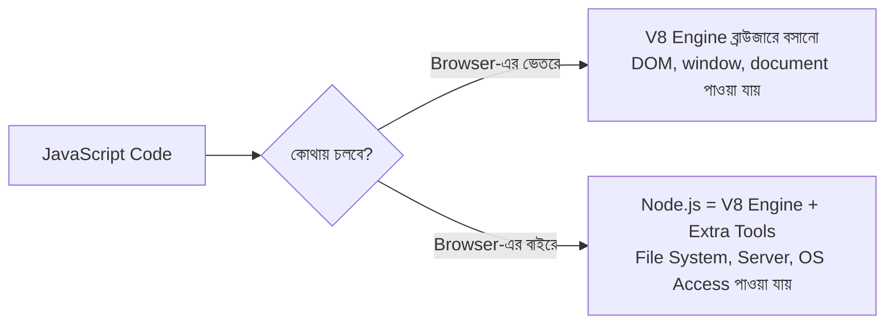
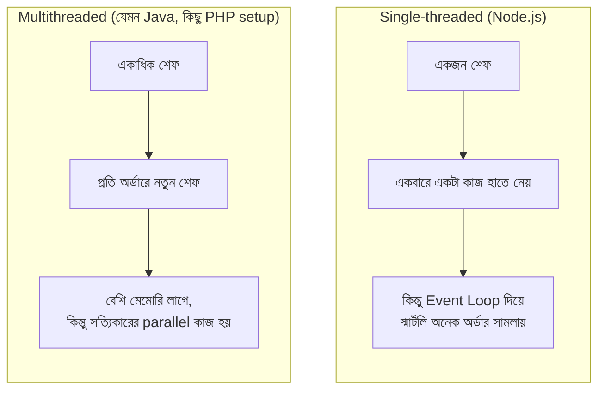
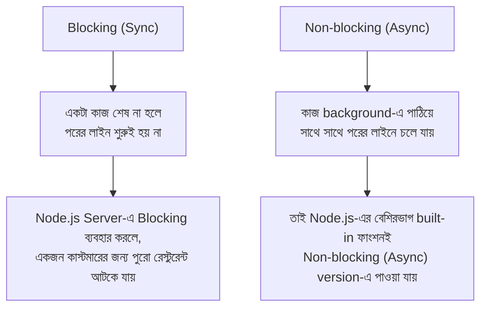
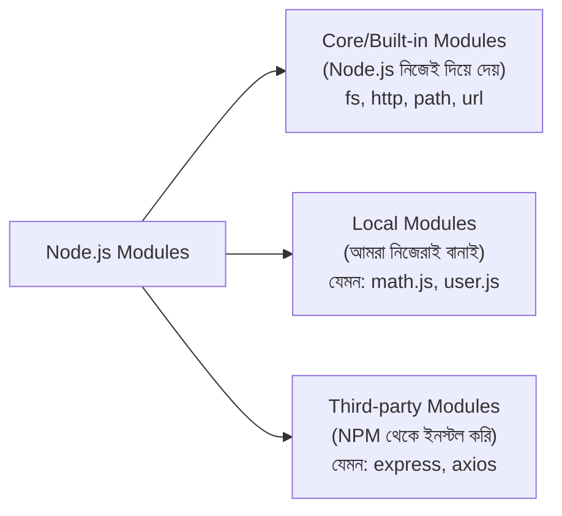
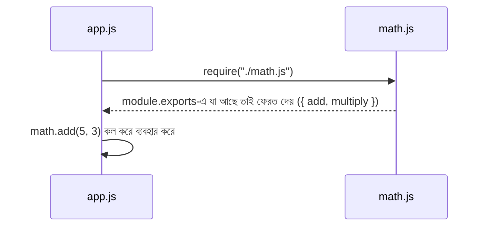
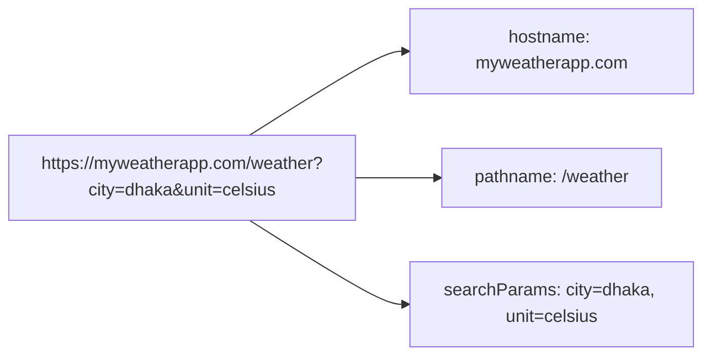
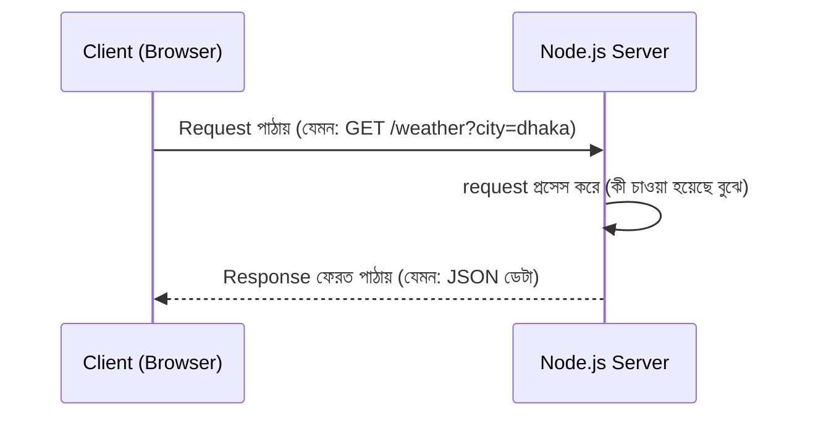
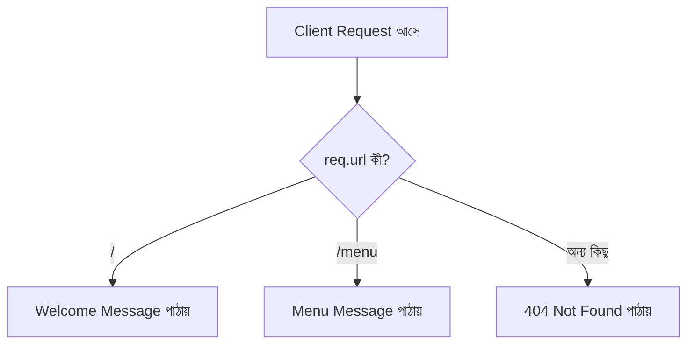

# 🍳 রেস্টুরেন্টের রান্নাঘর: Node.js-এর জগতে প্রবেশ

> এই ডকুমেন্টটাও আগের DOM/Async ফাইলের মতোই **গল্প আকারে** লেখা, যাতে concept গুলো মুখস্থ না হয়ে মাথায় গেঁথে যায়। আগের গল্পে JavaScript ছিলো রেস্টুরেন্টের **ওয়েটার** (Frontend/Browser)। এবার আমরা যাবো রেস্টুরেন্টের **রান্নাঘরে** (Backend/Server) — যেখানে Node.js হলো রান্নাঘরের প্রধান শেফ।

---

## 📚 সূচিপত্র (Table of Contents)

1. [ভূমিকা: রান্নাঘরের গল্প](#ভূমিকা-রান্নাঘরের-গল্প)
2. [Running JavaScript in Node.js](#১-running-javascript-in-nodejs)
3. [Node.js কী — Single-threaded vs Multithreaded](#২-nodejs-কী--single-threaded-vs-multithreaded)
4. [Synchronous vs Asynchronous](#৩-synchronous-vs-asynchronous)
5. [Blocking vs Non-blocking](#৪-blocking-vs-non-blocking)
6. [Module কী — Node.js-এ](#৫-module-কী--nodejsএ)
7. [module.exports এবং require](#৬-moduleexports-এবং-require)
8. [NPM — রান্নাঘরের বাজার](#৭-npm--রান্নাঘরের-বাজার)
9. [package.json বোঝা](#৮-packagejson-বোঝা)
10. [URL Module](#৯-url-module)
11. [HTTP Module](#১০-http-module)
12. [HTTP Server তৈরি করা](#১১-http-server-তৈরি-করা)
13. [সব মিলিয়ে: Weather App-এর ছোট্ট Backend](#১২-সব-মিলিয়ে-weather-app-এর-ছোট্ট-backend)
14. [সারসংক্ষেপ ও Practice আইডিয়া](#১৩-সারসংক্ষেপ-ও-practice-আইডিয়া)

---

## ভূমিকা: রান্নাঘরের গল্প

আগের গল্পে বলেছিলাম, রেস্টুরেন্টে JavaScript হলো **ওয়েটার** — যে কাস্টমারের সামনে দাঁড়িয়ে টেবিল সাজায়, প্লেট বদলায়। কিন্তু ওয়েটার তো নিজে রান্না করে না। রান্না হয় **রান্নাঘরে (Kitchen)**, যেটা কাস্টমার দেখতেই পায় না — এটাই হলো **Backend / Server**।

সমস্যা ছিলো — আগে JavaScript শুধু **ব্রাউজারের ভেতরেই** চলতে পারতো (কারণ ব্রাউজারে V8 ইঞ্জিন থাকে যেটা JS বোঝে)। রান্নাঘরে (Server-এ) তো ব্রাউজার নেই! তাহলে রান্নাঘরের কাজ কে করবে?

এখানেই আসে **Node.js** — এটা মূলত Chrome ব্রাউজারের ভেতরের সেই **V8 Engine**-টাকেই ব্রাউজারের বাইরে নিয়ে এসে একটা standalone প্রোগ্রাম বানানো হয়েছে, যাতে JavaScript এখন রান্নাঘরেও (Server-এ, Computer-এ) চলতে পারে। অর্থাৎ Node.js নিজে একটা ভাষা না — এটা একটা **Runtime Environment**, যেটা JavaScript-কে ব্রাউজারের বাইরে চালানোর ক্ষমতা দেয়।



চলুন ধাপে ধাপে পুরো রান্নাঘরটা ঘুরে দেখি।

---

## ১. Running JavaScript in Node.js

ব্রাউজারে JS চালাতে হলে আমরা `<script>` ট্যাগ বা DevTools Console ব্যবহার করতাম। Node.js-এ JS চালানো আরও সহজ — কারণ এটা একটা প্রোগ্রাম, যেটা টার্মিনাল থেকে চালানো যায়।

### দুইভাবে চালানো যায়

**১) সরাসরি REPL (Read-Eval-Print-Loop)** — টার্মিনালে `node` লিখে এন্টার দিলে একটা ইন্টারেক্টিভ কনসোল খুলে যায়, যেখানে এক লাইন করে কোড লিখে সাথে সাথে রেজাল্ট দেখা যায়:

```bash
$ node
> console.log("রান্নাঘরে স্বাগতম!");
রান্নাঘরে স্বাগতম!
> 5 + 5
10
```

**২) ফাইল রান করা** — সাধারণত আমরা `.js` ফাইলে কোড লিখে সেই ফাইলটা Node দিয়ে রান করি:

```bash
# app.js ফাইলে কোড লিখলাম
$ node app.js
```

```javascript
// app.js
console.log("রান্নাঘরের শেফ কাজ শুরু করলো!");
```

### গুরুত্বপূর্ণ পার্থক্য: Browser-এর JS বনাম Node.js-এর JS

ওয়েটার (Browser JS) আর শেফ (Node.js) দুজনেই JavaScript বোঝে, কিন্তু দুজনের হাতের কাছে **আলাদা জিনিসপত্র** থাকে:

| Browser-এ যা আছে | Node.js-এ যা আছে |
|---|---|
| `window`, `document` (DOM) | নেই — কারণ কোনো "পেজ" নেই |
| `alert()`, `localStorage` | নেই |
| File System access নেই (নিরাপত্তার কারণে) | `fs` module দিয়ে ফাইল পড়া/লেখা যায় |
| Server বানানো যায় না | `http` module দিয়ে Server বানানো যায় |

মানে, ওয়েটার শুধু ডাইনিং হলের জিনিস (DOM) নিয়ে কাজ করে, আর শেফ রান্নাঘরের জিনিস (File System, Network, OS) নিয়ে কাজ করে — যদিও দুজনেরই "ভাষা" এক।

---

## ২. Node.js কী — Single-threaded vs Multithreaded

### থিওরি

রান্নাঘরে একজন প্রধান শেফ আছে (Node.js), আর তিনি **একবারে একটা কাজই** হাতে নিতে পারেন — একে বলে **Single-threaded**। মানে একটা মুহূর্তে শেফের হাত একটাই কাজ করছে, লাইন ধরে ধরে।

তুলনায়, কিছু রেস্টুরেন্টে (যেমন Java বা PHP-এর কিছু সেটআপে) একসাথে **একাধিক শেফ (Thread)** কাজ করে — প্রতিটা অর্ডারের জন্য নতুন একজন শেফ assign হয়ে যায়। একে বলে **Multithreaded**।



### তাহলে Node.js একটা শেফ দিয়ে কীভাবে হাজার হাজার অর্ডার সামলায়?

উত্তর হলো — Node.js **নিজে** রান্না করে না ভারী কাজগুলো (যেমন ফাইল পড়া, ডাটাবেজ কল, নেটওয়ার্ক রিকোয়েস্ট)। এই ভারী কাজগুলো সে **রান্নাঘরের সহকারীদের (Background Workers / libuv)** হাতে দিয়ে দেয়, আর নিজে পরের অর্ডার নেওয়া শুরু করে। কাজ শেষ হলে সহকারীরা এসে শেফকে জানায়, তখন শেফ ফলাফলটা সার্ভ করে।

এটাই Node.js-কে এত দ্রুত আর efficient বানায় — একজন শেফ হয়েও সে ব্লক না হয়ে অনেক কাস্টমার সামলাতে পারে। এই পুরো ম্যাজিকটাই চলে **Asynchronous, Non-blocking** পদ্ধতিতে — যেটা এখন আমরা দেখবো।

---

## ৩. Synchronous vs Asynchronous

### গল্প দিয়ে বুঝি

**Synchronous (সিঙ্ক্রোনাস)** — কল্পনা করুন, শেফ একটা অর্ডার নিলো, এবং যতক্ষণ না সেই খাবার সম্পূর্ণ রান্না হয়ে প্লেটে যাচ্ছে, ততক্ষণ তিনি **অন্য কোনো অর্ডারের দিকে তাকাচ্ছেনও না**। এক অর্ডার শেষ, তারপর পরেরটা শুরু। লাইনে ধাপে ধাপে, উপর থেকে নিচে।

**Asynchronous (অ্যাসিঙ্ক্রোনাস)** — শেফ একটা অর্ডার (ধরুন, বিরিয়ানি) চুলায় বসিয়ে দিলো, তারপর **সেটা রান্না হওয়ার অপেক্ষা না করেই** পরের কাস্টমারের অর্ডার নেওয়া শুরু করলো। বিরিয়ানি রান্না হয়ে গেলে, একটা "ঘণ্টা" (Callback/Notification) বাজবে, আর শেফ তখন সেটা সার্ভ করবে।

```javascript
// Synchronous উদাহরণ
console.log("১. অর্ডার নিলাম");
console.log("২. রান্না করলাম");   // এটা শেষ না হলে নিচেরটা চলবে না
console.log("৩. সার্ভ করলাম");

// আউটপুট সবসময় ১, ২, ৩ ক্রমেই আসবে
```

```javascript
// Asynchronous উদাহরণ
console.log("১. অর্ডার নিলাম");

setTimeout(() => {
  console.log("৩. রান্না শেষ, সার্ভ করলাম"); // এটা দেরিতে চলবে
}, 2000);

console.log("২. পরের কাস্টমারের অর্ডার নিলাম"); // এটা আগেই চলে যাবে

// আউটপুট হবে: ১, ২, তারপর ২ সেকেন্ড পর ৩
```

যেহেতু Node.js **single-threaded**, তার জন্য Asynchronous পদ্ধতিটা তার বেঁচে থাকার মূল উপায়। যদি সে প্রতিটা কাজ Synchronous ভাবে করতো, তাহলে একজন কাস্টমারের বিরিয়ানি রান্না না হওয়া পর্যন্ত বাকি সবাইকে বসে অপেক্ষা করতে হতো — পুরো রেস্টুরেন্ট থমকে যেতো।

---

## ৪. Blocking vs Non-blocking

এই কনসেপ্টটা Sync/Async-এর সাথে খুব কাছের সম্পর্কিত, কিন্তু একটু ভিন্ন কোণ থেকে দেখে — এটা দেখে **রিসোর্সটা (শেফের হাত) কতক্ষণ আটকে থাকে**।

### Blocking (আটকে থাকা)

শেফ যখন ফাইল থেকে রেসিপি পড়তে যায় (`fs.readFileSync`), আর সেই পড়া শেষ না হওয়া পর্যন্ত **পুরো রান্নাঘর (পুরো প্রোগ্রাম) থেমে থাকে**, অন্য কোনো কাজই এগোয় না — একে বলে Blocking।

```javascript
const fs = require("fs");

console.log("১. শুরু");

// এই লাইন শেষ না হওয়া পর্যন্ত নিচের কোড রান হবে না — Blocking!
const data = fs.readFileSync("recipe.txt", "utf-8");
console.log("২. রেসিপি পড়া হলো:", data);

console.log("৩. শেষ");
```

### Non-blocking (আটকে না থাকা)

শেফ ফাইল পড়ার কাজটা background-এ পাঠিয়ে দেয়, আর নিজে সাথে সাথে **পরের লাইনের কাজে চলে যায়**। ফাইল পড়া শেষ হলে callback function-টা কল হয়ে ফলাফল জানিয়ে দেয় — একে বলে Non-blocking।

```javascript
const fs = require("fs");

console.log("১. শুরু");

// এটা background-এ চলবে, প্রোগ্রাম আটকাবে না — Non-blocking!
fs.readFile("recipe.txt", "utf-8", (err, data) => {
  console.log("২. রেসিপি পড়া হলো:", data);
});

console.log("৩. শেষ (এটা রেসিপি পড়ার আগেই প্রিন্ট হবে!)");
```

**আউটপুট হবে:** ১. শুরু → ৩. শেষ → ২. রেসিপি পড়া হলো (দেরিতে)



> **নিয়ম:** Node.js দিয়ে Server বানানোর সময় প্রায় সবসময় Non-blocking (Async) ভার্সন ব্যবহার করা উচিত (`fs.readFile`, `fs.writeFile`) — Blocking ভার্সন (`readFileSync`) শুধু ছোট script বা startup-এর সময়েই ব্যবহার করা ঠিক, যেখানে অপেক্ষা করাটা সমস্যা না।

---

## ৫. Module কী — Node.js-এ

### থিওরি

রান্নাঘরের সব রেসিপি যদি **একটা মাত্র বইয়ে** লেখা থাকে — স্টার্টার, মেইন কোর্স, ডেজার্ট, সব একসাথে — তাহলে খুঁজে বের করা আর maintain করা কঠিন হয়ে যাবে। তাই স্মার্ট রান্নাঘর **আলাদা আলাদা রেসিপি বই** রাখে — একটা বইয়ে শুধু স্টার্টার, একটায় শুধু ডেজার্ট।

Node.js-এ এই "আলাদা রেসিপি বই"-টাই হলো একটা **Module** — অর্থাৎ, একটা `.js` ফাইল, যেটার ভেতরে নির্দিষ্ট কিছু কোড (function, variable, object) লেখা থাকে, এবং সেটা প্রয়োজনে অন্য ফাইলে **import করে ব্যবহার করা যায়**।

### Module তিন ধরনের হয়



Module ব্যবহার করার সবচেয়ে বড় সুবিধা — কোড **reusable** হয়ে যায় (একই কোড বারবার লেখা লাগে না), এবং প্রজেক্ট **organized** থাকে (প্রতিটা ফাইলের একটা নির্দিষ্ট দায়িত্ব থাকে)।

---

## ৬. module.exports এবং require

শেফ যখন একটা রেসিপি বই লিখে অন্য শেফের সাথে শেয়ার করতে চায়, তখন দুইটা কাজ লাগে:

1. **বইয়ের লেখক** (যে ফাইলে রেসিপি আছে) বলবে — "এই রেসিপিগুলো বাইরে শেয়ার করার জন্য উন্মুক্ত" → এটাই `module.exports`
2. **যে শেফ ব্যবহার করবে**, সে বলবে — "আমাকে ওই বইটা এনে দাও" → এটাই `require()`

### উদাহরণ

```javascript
// math.js  (এটা আমাদের নিজের বানানো Local Module)
function add(a, b) {
  return a + b;
}

function multiply(a, b) {
  return a * b;
}

// এই দুইটা ফাংশন বাইরে ব্যবহারযোগ্য করে দিলাম
module.exports = { add, multiply };
```

```javascript
// app.js
const math = require("./math.js"); // ./ দিয়ে বোঝাচ্ছি এটা local ফাইল

console.log(math.add(5, 3));       // 8
console.log(math.multiply(5, 3));  // 15
```



### Core Module কল করা

Built-in module গুলো require করতে `./` লাগে না, কারণ সেগুলো Node.js-এর নিজের ভেতরেই বিল্ট-ইন থাকে:

```javascript
const fs = require("fs");     // File System module
const http = require("http"); // HTTP module
const url = require("url");   // URL module
```

> **নোট:** এইটা হলো পুরনো/ক্লাসিক পদ্ধতি, যাকে বলে **CommonJS** (`require`/`module.exports`)। আধুনিক JavaScript-এ আরেকটা পদ্ধতি আছে, **ES Modules** (`import`/`export`), যেটা `package.json`-এ `"type": "module"` সেট করে ব্যবহার করা যায়। দুটোর কাজ একই — শুধু সিনট্যাক্স আলাদা।

---

## ৭. NPM — রান্নাঘরের বাজার

রান্নাঘরে সব উপকরণ (মশলা, তেল, বিশেষ সস) নিজেরা বানানো সম্ভব না — কিছু জিনিস **বাজার থেকে কিনে আনতে হয়**। **NPM (Node Package Manager)** হলো সেই বাজার — যেখানে হাজার হাজার ready-made "উপকরণ" (Package/Library) পাওয়া যায়, যেগুলো অন্য ডেভেলপাররা বানিয়ে সবার জন্য উন্মুক্ত করে রেখেছে।

### NPM দিয়ে যা করা যায়

```bash
# একটা প্যাকেজ ইনস্টল করা (যেমন axios — API কল করার জন্য জনপ্রিয় লাইব্রেরি)
npm install axios

# শুধু development-এর সময় লাগবে এমন প্যাকেজ (যেমন nodemon)
npm install --save-dev nodemon

# একটা প্যাকেজ পুরো সিস্টেমে ব্যবহারের জন্য (global)
npm install -g nodemon

# প্যাকেজ আনইনস্টল
npm uninstall axios
```

ইনস্টল করা প্যাকেজগুলো একটা `node_modules` ফোল্ডারে জমা হয় (এটা সাধারণত Git-এ আপলোড করা হয় না, `.gitignore`-এ রাখা হয়, কারণ এটা অনেক ভারী হয়ে যায়)।

```javascript
const axios = require("axios"); // NPM থেকে ইনস্টল করা Third-party Module

async function getWeather() {
  const res = await axios.get("https://api.weatherapi.com/v1/current.json");
  console.log(res.data);
}
```

---

## ৮. package.json বোঝা

প্রতিটা রান্নাঘরের একটা **রেজিস্ট্রি বই** থাকে — যেখানে লেখা থাকে রান্নাঘরের নাম, ভার্সন, কোন কোন উপকরণ বাজার থেকে আনা হয়েছে, আর রান্নাঘর চালু করতে কোন কমান্ড দিতে হয়। Node.js প্রজেক্টে এই বইটাই হলো `package.json`।

### তৈরি করা

```bash
npm init          # প্রশ্ন করে করে সেটআপ করবে
npm init -y       # ডিফল্ট মান দিয়ে সাথে সাথে বানাবে
```

### একটা সাধারণ package.json

```json
{
  "name": "weather-app-backend",
  "version": "1.0.0",
  "description": "Node.js দিয়ে বানানো Weather App-এর Backend",
  "main": "index.js",
  "scripts": {
    "start": "node index.js",
    "dev": "nodemon index.js"
  },
  "dependencies": {
    "axios": "^1.6.0"
  },
  "devDependencies": {
    "nodemon": "^3.0.0"
  }
}
```

| Field | মানে |
|---|---|
| `name`, `version` | প্রজেক্টের নাম আর ভার্সন |
| `main` | কোন ফাইল থেকে প্রজেক্ট শুরু হবে |
| `scripts` | শর্টকাট কমান্ড — যেমন `npm run dev` দিলে `nodemon index.js` চলবে |
| `dependencies` | যেসব প্যাকেজ প্রোডাকশনে সবসময় লাগবে |
| `devDependencies` | যেসব প্যাকেজ শুধু ডেভেলপমেন্টের সময় লাগবে |

> **টিপস:** `package.json` থাকলে, অন্য কেউ (বা আপনি অন্য কম্পিউটারে) প্রজেক্টটা ক্লোন করে শুধু `npm install` চালালেই সব dependency অটো ইনস্টল হয়ে যায় — `node_modules` ফোল্ডার শেয়ার করার দরকার হয় না, `package.json` থাকলেই যথেষ্ট।

---

## ৯. URL Module

কাস্টমার যখন একটা "ঠিকানা" (URL) দিয়ে অর্ডার করে, যেমন:

```
https://myweatherapp.com/weather?city=dhaka&unit=celsius
```

তখন শেফের (Server-এর) দরকার হয় এই লম্বা ঠিকানাটা থেকে **অংশ অংশ আলাদা করে বোঝা** — কোন শহর চাওয়া হয়েছে, কোন ইউনিট চাওয়া হয়েছে ইত্যাদি। এই কাজে সাহায্য করে built-in **`url`** module।

```javascript
const url = require("url");

const myUrl = new URL("https://myweatherapp.com/weather?city=dhaka&unit=celsius");

console.log(myUrl.hostname);     // myweatherapp.com
console.log(myUrl.pathname);     // /weather
console.log(myUrl.search);       // ?city=dhaka&unit=celsius
console.log(myUrl.searchParams.get("city")); // dhaka
console.log(myUrl.searchParams.get("unit")); // celsius
```



এই module-টাই ব্যবহার করে Server বুঝতে পারে, কাস্টমার আসলে **কোন রুট (route)** আর **কী কী প্যারামিটার** নিয়ে অনুরোধ করেছে।

---

## ১০. HTTP Module

এবার আসল কাজের জিনিস — **`http`** module। এটাই Node.js-কে "রেস্টুরেন্টের দরজা" বানিয়ে দেয়, যার মাধ্যমে বাইরের কাস্টমার (Browser/Client) রান্নাঘরে (Server-এ) request পাঠাতে পারে, আর রান্নাঘর response ফেরত দিতে পারে।

### রিকোয়েস্ট-রেসপন্স চক্র



`http` module-এর মূল কাজ দুইটা জিনিস দিয়ে হয়:

- **`req` (Request)** — কাস্টমারের অর্ডার-স্লিপ, এতে থাকে URL, method (GET/POST), headers ইত্যাদি
- **`res` (Response)** — শেফের প্লেট, যেটা দিয়ে কাস্টমারকে উত্তর পাঠানো হয়

```javascript
const http = require("http");

const server = http.createServer((req, res) => {
  console.log("রিকোয়েস্ট এলো:", req.url);

  res.writeHead(200, { "Content-Type": "text/plain" }); // স্ট্যাটাস কোড + হেডার
  res.end("রান্নাঘর থেকে সালাম!");                          // রেসপন্স পাঠিয়ে শেষ করলাম
});
```

---

## ১১. HTTP Server তৈরি করা

এখন `http` module ব্যবহার করে একটা সম্পূর্ণ ছোট Server বানাই — যেটা `listen()` মেথড দিয়ে একটা নির্দিষ্ট **Port**-এ (রান্নাঘরের দরজায়) দাঁড়িয়ে অপেক্ষা করবে।

```javascript
const http = require("http");

const server = http.createServer((req, res) => {
  if (req.url === "/") {
    res.writeHead(200, { "Content-Type": "text/plain" });
    res.end("স্বাগতম আমাদের রান্নাঘরে!");
  } else if (req.url === "/menu") {
    res.writeHead(200, { "Content-Type": "text/plain" });
    res.end("আজকের মেনু: বিরিয়ানি, কাবাব, ফালুদা");
  } else {
    res.writeHead(404, { "Content-Type": "text/plain" });
    res.end("দুঃখিত, এই পেজ পাওয়া যায়নি (404)");
  }
});

const PORT = 3000;
server.listen(PORT, () => {
  console.log(`রান্নাঘর এখন ${PORT} নম্বর দরজায় প্রস্তুত!`);
});
```

```bash
$ node app.js
রান্নাঘর এখন 3000 নম্বর দরজায় প্রস্তুত!
```

এখন ব্রাউজারে `http://localhost:3000/` বা `http://localhost:3000/menu` খুললে উপরের রেসপন্স পাওয়া যাবে।



> **মনে রাখার বিষয়:** এভাবে `if/else` দিয়ে URL চেক করে routing করাটাই raw Node.js-এর নিয়ম। প্রজেক্ট বড় হলে এই কাজ সহজ করার জন্য **Express.js** নামের একটা জনপ্রিয় framework ব্যবহার করা হয় (যেটা NPM থেকেই ইনস্টল করতে হয়) — কিন্তু raw `http` module কীভাবে কাজ করে সেটা বোঝাটাই এই মডিউলের ভিত্তি।

---

## ১২. সব মিলিয়ে: Weather App-এর ছোট্ট Backend

যেহেতু এই টপিকের নামই **"Weather App - Introduction to Node.js"**, চলুন এই মডিউলের সব কনসেপ্ট (Module, require, URL, HTTP) একসাথে জুড়ে একটা mini backend বানাই, যেটা `city` নাম দিলে একটা ডামি ওয়েদার রেসপন্স ফেরত দেয়।

```javascript
// weather.js  (Local Module — ডামি ওয়েদার ডেটা)
const weatherData = {
  dhaka: { temp: "৩২°C", condition: "রৌদ্রোজ্জ্বল" },
  sylhet: { temp: "২৭°C", condition: "মেঘলা" },
  khulna: { temp: "৩০°C", condition: "হালকা বৃষ্টি" },
};

function getWeather(city) {
  return weatherData[city.toLowerCase()] || { error: "এই শহরের তথ্য নেই" };
}

module.exports = { getWeather };
```

```javascript
// app.js  (Main Server)
const http = require("http");
const url = require("url");
const { getWeather } = require("./weather.js"); // Local Module import

const server = http.createServer((req, res) => {
  const parsedUrl = url.parse(req.url, true); // URL module দিয়ে ভাঙা হলো

  if (parsedUrl.pathname === "/weather") {
    const city = parsedUrl.query.city || "dhaka";
    const result = getWeather(city);

    res.writeHead(200, { "Content-Type": "application/json" });
    res.end(JSON.stringify(result));
  } else {
    res.writeHead(404, { "Content-Type": "text/plain" });
    res.end("404 - পেজ পাওয়া যায়নি");
  }
});

server.listen(3000, () => {
  console.log("Weather App Server চালু হলো: http://localhost:3000");
});
```

```
GET http://localhost:3000/weather?city=sylhet

Response:
{"temp":"২৭°C","condition":"মেঘলা"}
```

এই একটা ছোট্ট উদাহরণেই এই টপিকের প্রায় সব কনসেপ্ট এক জায়গায় দেখা গেলো — Node.js runtime, Local Module (`weather.js`) + `module.exports`/`require`, built-in `url` ও `http` module, এবং কীভাবে non-blocking ভাবে request handle হয়।

---

## ১৩. সারসংক্ষেপ ও Practice আইডিয়া

```mermaid
mindmap
  root((Node.js রান্নাঘর))
    Node.js Basics
      JS ব্রাউজারের বাইরে চালানো
      V8 Engine + Extra Tools
      Single-threaded
        Event Loop দিয়ে ম্যানেজ করে
    Sync vs Async
      Synchronous - ধাপে ধাপে
      Asynchronous - ব্যাকগ্রাউন্ডে পাঠিয়ে এগিয়ে যাওয়া
    Blocking vs Non-blocking
      Blocking - পুরো প্রোগ্রাম আটকে যায়
      Non-blocking - কাজ চলতেই থাকে
    Modules
      Core Modules - fs, http, url
      Local Modules - নিজে বানানো
      Third-party - NPM থেকে
      module.exports এবং require
    NPM
      Package Install
      dependencies vs devDependencies
    package.json
      scripts
      main entry point
    URL Module
      hostname, pathname, searchParams
    HTTP Module
      createServer
      req এবং res
    HTTP Server
      listen()
      Routing (if/else দিয়ে)
```

### Practice-এর জন্য আইডিয়া

যেহেতু এটাও Git-এ আপলোড হবে, নিচের ছোট প্রজেক্টগুলো বানিয়ে এই মডিউলের ফোল্ডারে রাখতে পারেন:

1. **Basic Router Server** — `/`, `/about`, `/contact` — আলাদা আলাদা রুটে আলাদা রেসপন্স পাঠানো (raw `http` module দিয়ে)।
2. **Local Module Practice** — `calculator.js` নামে একটা module বানিয়ে `add`, `subtract`, `multiply`, `divide` export করা, তারপর `app.js`-এ `require` করে ব্যবহার করা।
3. **URL Parser Practice** — কয়েকটা ভিন্ন URL নিয়ে `url` module দিয়ে query parameter বের করে দেখা।
4. **Weather App Extend** — এই ফাইলের শেষের উদাহরণটা নিয়ে আরও শহর যোগ করা, আর `fs` module দিয়ে ওয়েদার ডেটা একটা `.json` ফাইল থেকে পড়ে আনা (পরের মডিউলে যখন `fs` শেখা হবে)।

---

## 📌 GitHub-এ যেভাবে রাখতে পারেন

আপনার বলা অনুযায়ী রিপো স্ট্রাকচার এমন হতে পারে:

```
📦 Ostad-mern-stack
 ┗ 📂 module-09-backend-node-js-server-side-modern-js/
   ┣ 📜 weather-app-introduction-to-node-js.md   ← এই ফাইলটা
   ┣ 📂 weather-app-demo/
   ┃ ┣ 📜 app.js
   ┃ ┗ 📜 weather.js
   ┗ 📂 practice/
     ┣ 📜 basic-router-server.js
     ┗ 📜 calculator.js
```

আগের DOM/Async ফাইলের মতোই — সব কোড ব্লক syntax-highlighted, আর সব Mermaid diagram GitHub-এ natively render হবে, তাই কোনো extra সেটআপ ছাড়াই দেখা যাবে।
ding weather-app-introduction-to-node-js.md…]()

