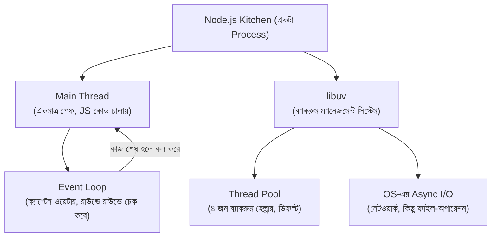
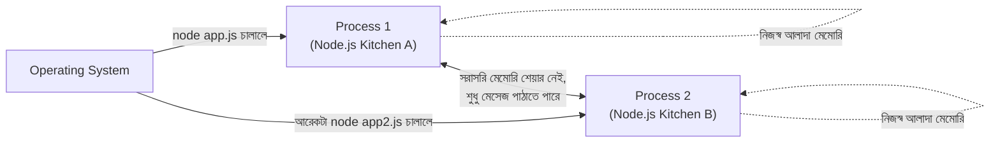
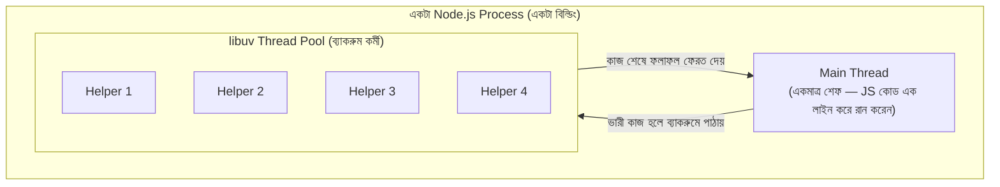
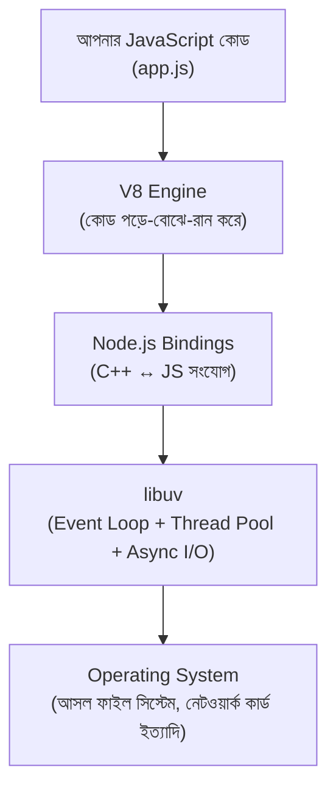
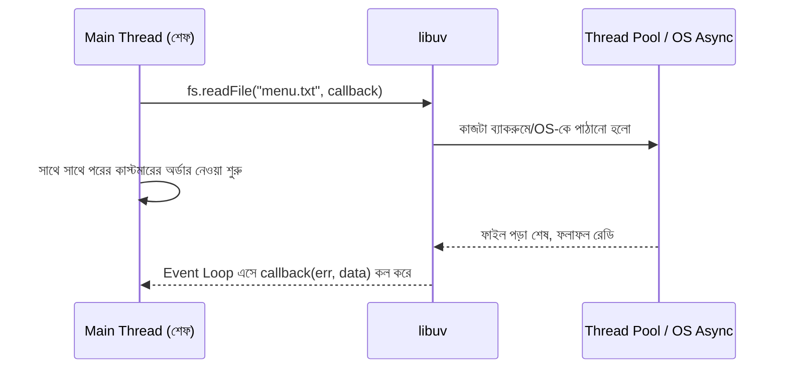
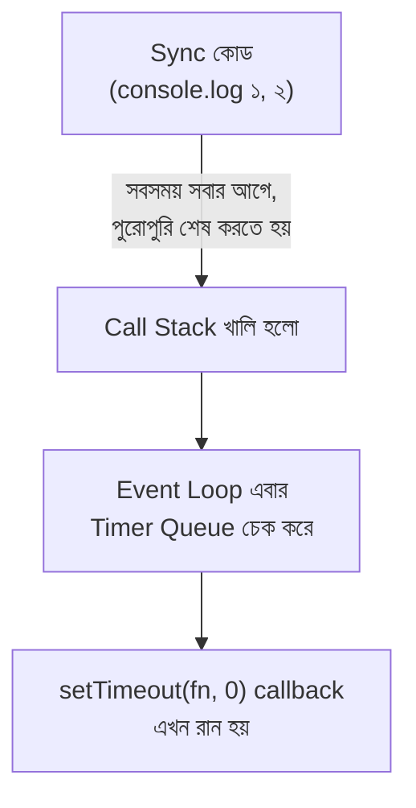
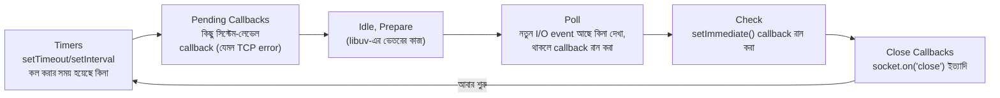
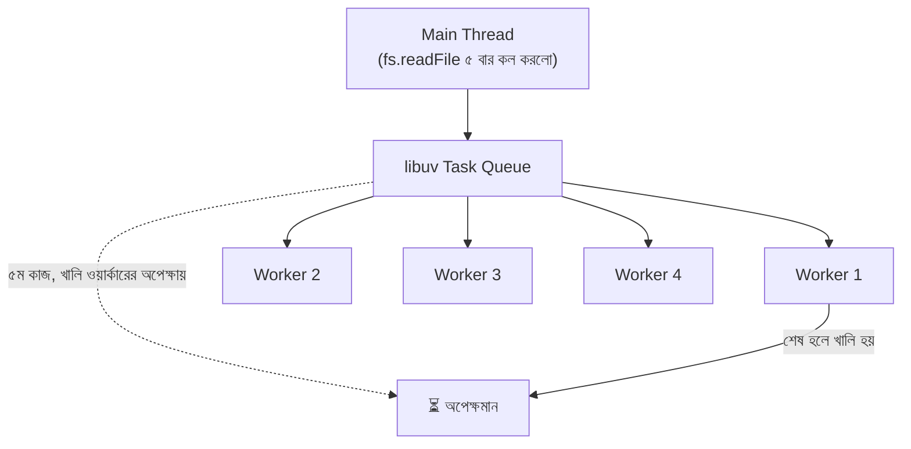
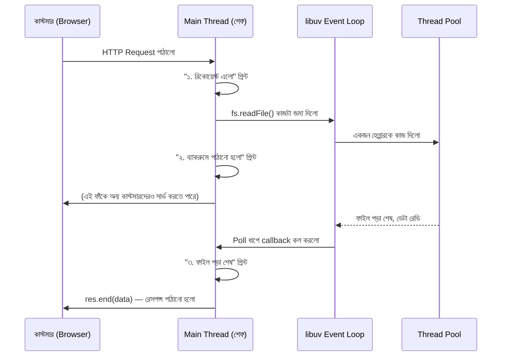
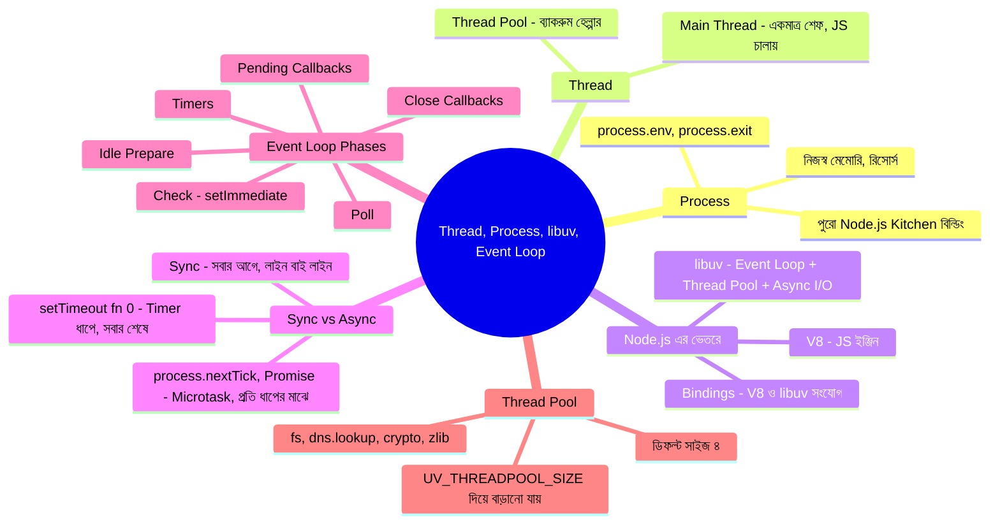

# 🏭 রেস্টুরেন্টের ভেতরের গল্প: Thread, Process, libuv আর Event Loop

> এই ডকুমেন্টটাও আগের ফাইলগুলোর মতোই **গল্প আকারে** লেখা, যাতে concept গুলো মুখস্থ না হয়ে মাথায় গেঁথে যায়। আগের ফাইলে আমরা দেখেছিলাম, শেফ (Node.js) কীভাবে রেসিপির খাতায় (`fs`) লেখে-পড়ে, আর ঘণ্টা বাজিয়ে (`events`) বাকিদের জানায়। কিন্তু একটা প্রশ্ন এখনো বাকি — **এই পুরো রেস্টুরেন্টটা আসলে ভেতরে ভেতরে চলে কীভাবে?** একজনই কি সব কাজ করে, নাকি অনেকে মিলে? আর "একসাথে অনেক কাস্টমার সামলানো" ব্যাপারটা আসলে কোন জাদুতে হয়? আজকের গল্পে আমরা রেস্টুরেন্টের দেয়াল ভেঙে ভেতরে ঢুকে দেখবো।

---

## 📚 সূচিপত্র (Table of Contents)

1. [ভূমিকা: রেস্টুরেন্টের ভেতরে উঁকি](#ভূমিকা-রেস্টুরেন্টের-ভেতরে-উঁকি)
2. [Process কী — পুরো রেস্টুরেন্ট বিল্ডিং](#১-process-কী--পুরো-রেস্টুরেন্ট-বিল্ডিং)
3. [Thread কী — রেস্টুরেন্টের কর্মী](#২-thread-কী--রেস্টুরেন্টের-কর্মী)
4. [Node.js-এর ভেতরে কী আছে](#৩-nodejs-এর-ভেতরে-কী-আছে)
5. [libuv আর Async I/O — ব্যাকরুম সাপোর্ট টিম](#৪-libuv-আর-async-io--ব্যাকরুম-সাপোর্ট-টিম)
6. [Sync vs Async vs setTimeout(fn, 0)](#৫-sync-vs-async-vs-settimeoutfn-0)
7. [libuv & Event Loop — ক্যাপ্টেন ওয়েটারের রাউন্ড](#৬-libuv--event-loop--ক্যাপ্টেন-ওয়েটারের-রাউন্ড)
8. [Thread Pool in libuv — ব্যাকরুমের ৪ জন হেল্পার](#৭-thread-pool-in-libuv--ব্যাকরুমের-৪-জন-হেল্পার)
9. [সব মিলিয়ে: একটা রিকোয়েস্টের সম্পূর্ণ যাত্রা](#৮-সব-মিলিয়ে-একটা-রিকোয়েস্টের-সম্পূর্ণ-যাত্রা)
10. [সারসংক্ষেপ ও Practice আইডিয়া](#৯-সারসংক্ষেপ-ও-practice-আইডিয়া)
11. [GitHub-এ যেভাবে রাখতে পারেন](#-github-এ-যেভাবে-রাখতে-পারেন)

---

## ভূমিকা: রেস্টুরেন্টের ভেতরে উঁকি

কল্পনা করুন, আপনি রাস্তা দিয়ে হাঁটছেন আর একটা রেস্টুরেন্ট দেখলেন — নাম **"Node.js Kitchen"**। বাইরে থেকে দেখলে মনে হয় এটা একটা সাধারণ দোকান। কিন্তু ভেতরে ঢুকলে দেখবেন আসলে এখানে অনেকগুলো স্তর কাজ করছে:

- পুরো **বিল্ডিংটাই** একটা স্বতন্ত্র প্রতিষ্ঠান — এর নিজস্ব বিদ্যুৎ লাইন, নিজস্ব ঠিকানা, নিজস্ব সম্পদ আছে। এটাই **Process**।
- বিল্ডিংয়ের ভেতরে **কর্মীরা** কাজ করে — কেউ রান্না করে, কেউ ব্যাকরুমে সাপোর্ট দেয়। এই কর্মীদের বলা হয় **Thread**।
- মূল শেফ (যিনি JavaScript কোড রান করান) **একাই একটা লাইনে দাঁড়িয়ে** এক এক করে কাজ করেন — একসাথে দুইটা কাজ করেন না। কিন্তু তাও রেস্টুরেন্টটা একসাথে শত শত কাস্টমার সামলাতে পারে, কারণ ভারী-সময়সাপেক্ষ কাজগুলো (ফাইল পড়া, নেটওয়ার্ক কল) তিনি **ব্যাকরুম টিমের (libuv)** হাতে দিয়ে দেন।
- আর একজন **ক্যাপ্টেন ওয়েটার** সবসময় ঘুরে ঘুরে চেক করেন — "কার কাজ শেষ হয়েছে? এখন কাকে ডাকতে হবে?" — এই ক্যাপ্টেনটাই হলো **Event Loop**।



চলুন একটা একটা করে ভেতরে ঢুকি।

---

## ১. Process কী — পুরো রেস্টুরেন্ট বিল্ডিং

**Process** হলো অপারেটিং সিস্টেমের চোখে একটা সম্পূর্ণ, স্বতন্ত্র প্রোগ্রাম — যার নিজস্ব **মেমোরি স্পেস**, নিজস্ব ভ্যারিয়েবল, নিজস্ব রিসোর্স আছে। আপনি যখন টার্মিনালে লেখেন —

```bash
node app.js
```

— তখন অপারেটিং সিস্টেম **একটা নতুন Process** তৈরি করে দেয়, যেটার ভেতরে পুরো Node.js ইঞ্জিন (V8 + libuv + Node-এর নিজের কোড) লোড হয়ে যায়। এটাই আমাদের **"Node.js Kitchen"** বিল্ডিংটা।

**গুরুত্বপূর্ণ বৈশিষ্ট্য:**

- দুইটা আলাদা Process একে অপরের মেমোরি সরাসরি দেখতে/বদলাতে পারে না — ঠিক যেমন দুইটা আলাদা রেস্টুরেন্ট বিল্ডিং একে অপরের ভেতরের রান্নাঘরে সরাসরি ঢুকতে পারে না। কথা বলতে হলে তাদের **বার্তা পাঠাতে হয়** (যেমন network request, বা `child_process`-এর মধ্যে IPC)।
- একটা Process ক্র্যাশ করলে (যদি আলাদাভাবে হ্যান্ডেল না করা হয়) সেটা সাধারণত অন্য Process-কে সরাসরি প্রভাবিত করে না — কারণ তারা সম্পূর্ণ আলাদা "বিল্ডিং"।
- Node.js-এ `process` নামে একটা গ্লোবাল অবজেক্টও আছে (যেমন `process.env`, `process.exit()`), যেটা দিয়ে বর্তমান Process সম্পর্কে তথ্য পাওয়া বা নিয়ন্ত্রণ করা যায়।



---

## ২. Thread কী — রেস্টুরেন্টের কর্মী

যদি Process হয় পুরো বিল্ডিং, তাহলে **Thread** হলো সেই বিল্ডিংয়ের ভেতরে কাজ করা **একেকজন কর্মী**। একই বিল্ডিংয়ের (Process-এর) ভেতরের সব Thread একসাথে একই মেমোরি/রিসোর্স শেয়ার করে — যেমন একই রেস্টুরেন্টের সব কর্মী একই রান্নাঘর, একই ফ্রিজ, একই মালামাল ব্যবহার করে।

**সবচেয়ে গুরুত্বপূর্ণ কথা:** JavaScript কোড রান করানোর জন্য Node.js-এ থাকে **মাত্র একটাই Thread** — একে বলে **Main Thread** (বা Single Thread)। এই একজন শেফই একে একে সব JS instruction পড়েন, একসাথে দুইটা লাইন কোড কখনো একই মুহূর্তে রান করেন না।



তাহলে প্রশ্ন আসে — যদি একজনই শেফ থাকেন, তাহলে হাজার হাজার কাস্টমারের রিকোয়েস্ট একসাথে কীভাবে সামলানো যায়? উত্তরটাই পরের সেকশনে — **libuv** নামের ব্যাকরুম টিমের গল্প।

> **টিপস:** এই "একজন শেফ" মডেলের সুবিধা হলো — কোড লেখা সহজ (একসাথে দুইটা Thread একই ভ্যারিয়েবল বদলানোর "রেস কন্ডিশন" নিয়ে চিন্তা করতে হয় না)। অসুবিধা হলো — শেফ যদি একটা ভারী হিসাব (যেমন বিশাল লুপ) নিজে করতে বসেন, তাহলে বাকি সব কাস্টমার আটকে যায়।

---

## ৩. Node.js-এর ভেতরে কী আছে

Node.js আসলে একটা একক জিনিস না — এটা কয়েকটা অংশ একসাথে জোড়া লাগানো একটা কাঠামো:

| অংশ | কাজ | রেস্টুরেন্টের ভাষায় |
|---|---|---|
| **V8 Engine** | JavaScript কোড বুঝে ও রান করে (Google Chrome-এরও এই একই ইঞ্জিন) | মূল শেফের মস্তিষ্ক — যিনি রেসিপি (কোড) পড়ে বুঝে কাজ করেন |
| **libuv** | Async I/O, Thread Pool, Event Loop সামলায় (C++ দিয়ে লেখা লাইব্রেরি) | ব্যাকরুম ম্যানেজমেন্ট সিস্টেম + ক্যাপ্টেন ওয়েটার |
| **Node.js Bindings** | V8 আর libuv-কে জোড়া লাগায়, `fs`, `http`-এর মতো module-গুলো দেয় | রান্নাঘর আর ব্যাকরুমের মাঝের সংযোগ পাইপলাইন |



**মূল কথা:** আপনি যখন `fs.readFile()` লেখেন, তখন আসলে JS কোড নিজে ফাইল পড়ে না — এটা শুধু **libuv-কে বলে দেয়** "এই কাজটা করে দাও, শেষ হলে জানিও"। libuv-ই আসল কাজটা করে (হয় Thread Pool দিয়ে, নাহলে OS-এর নিজস্ব async ক্ষমতা দিয়ে), আর শেষ হলে callback-টা আবার Main Thread-এ ফেরত পাঠায়।

---

## ৪. libuv আর Async I/O — ব্যাকরুম সাপোর্ট টিম

**libuv** হলো C++ দিয়ে লেখা একটা লাইব্রেরি, যেটা Node.js-এর সবচেয়ে গুরুত্বপূর্ণ "অদৃশ্য" অংশ। এটা তিনটা বড় দায়িত্ব পালন করে:

1. **Event Loop চালানো** — ক্যাপ্টেন ওয়েটারের রাউন্ড (পরের সেকশনে বিস্তারিত)।
2. **Thread Pool ম্যানেজ করা** — ব্যাকরুমের কয়েকজন হেল্পার, যারা ভারী/blocking কাজ করে দেয়।
3. **OS-এর নিজস্ব Async I/O ব্যবহার করা** — নেটওয়ার্কিং (TCP/HTTP)-এর মতো কাজের জন্য Thread Pool না লাগিয়ে সরাসরি OS-কেই (Linux-এ `epoll`, macOS-এ `kqueue`, Windows-এ `IOCP`) কাজ দিয়ে দেওয়া।

**Async I/O** মানে হলো — শেফ কোনো ভারী/সময়সাপেক্ষ কাজ (যেমন ফাইল পড়া, নেটওয়ার্ক কল, ডেটাবেজ কোয়েরি) নিজে না করে **অন্য কাউকে দিয়ে দেন**, আর নিজে সাথে সাথে পরের কাস্টমারের অর্ডার নিতে চলে যান। যখন সেই "অন্য কেউ" কাজ শেষ করে, তখন একটা **callback/event** এর মাধ্যমে শেফকে জানানো হয়।



> **কেন এটা গুরুত্বপূর্ণ:** এই কারণেই একজন মাত্র শেফ (Single Thread) থাকা সত্ত্বেও Node.js হাজার হাজার কানেকশন একসাথে সামলাতে পারে — কারণ শেফ কখনো কোনো I/O কাজের জন্য বসে অপেক্ষা করেন না, তিনি শুধু কাজ ভাগ করে দিয়ে পরের কাজে চলে যান।

---

## ৫. Sync vs Async vs setTimeout(fn, 0)

আগের ফাইলে আমরা `fs.readFileSync` বনাম `fs.readFile` দেখেছিলাম। এখন আরেকটা মজার জিনিস দেখি — `setTimeout(fn, 0)`, মানে "০ মিলিসেকেন্ড পরে চালাও" — এটা শুনতে মনে হয় "সাথে সাথেই চালাও", কিন্তু বাস্তবে তা না।

```javascript
console.log("১. প্রথম লাইন (Sync)");

setTimeout(() => {
  console.log("৩. setTimeout(fn, 0) — মনে হয় সাথে সাথে, কিন্তু আসলে দেরিতে চলে");
}, 0);

console.log("২. তৃতীয় লাইন (Sync)");
```

**আউটপুট হবে:** `১ → ২ → ৩` — মানে `০` মিলিসেকেন্ড বলা সত্ত্বেও `setTimeout`-এর ভেতরের কোডটা **সবার শেষে** রান হলো!

**কেন এমন হয়?** কারণ শেফের একটা নিয়ম আছে — **যেকোনো Sync (সাধারণ, লাইন বাই লাইন) কোড আগে পুরোপুরি শেষ করতে হবে**, তারপরেই তিনি "পরে করার জন্য জমা রাখা" কাজগুলোর দিকে (যেমন `setTimeout` callback) নজর দেন। `setTimeout(fn, 0)` আসলে বলে না "এখনই করো", এটা বলে — **"Sync কোড শেষ হওয়ার পর, Event Loop-এর Timer ধাপে যত তাড়াতাড়ি সম্ভব করো"**। libuv-এর ভেতরের নিয়ম অনুযায়ী `0` বললেও এটাকে কমপক্ষে `1` মিলিসেকেন্ড হিসেবেই ধরা হয়।



**তিনজনের অগ্রাধিকার (Priority) তুলনা করলে:**

| ধরন | কখন রান হয় | উদাহরণ |
|---|---|---|
| **Sync কোড** | সবার আগে, লাইন বাই লাইন | `console.log()`, সাধারণ ফাংশন কল |
| **`process.nextTick()`** | Sync কোড শেষ হওয়ার পর, Event Loop-এর *পরের ধাপে যাওয়ার আগেই* | মাইক্রো-জরুরি কাজ |
| **Promise `.then()`** | `nextTick`-এর ঠিক পরেই (Microtask Queue) | Async/await-এর ভেতরের কাজ |
| **`setTimeout(fn, 0)`** | Event Loop-এর **Timer** ধাপে | "একটু পরে করলেই হবে" টাইপ কাজ |
| **`setImmediate()`** | Event Loop-এর **Check** ধাপে (I/O-এর পরপরই) | I/O callback-এর পরে চালাতে চাইলে |

> **নিয়ম মনে রাখার সহজ উপায়:** Sync সবসময় প্রথমে। এরপর "Microtask" (nextTick, Promise) — এগুলো প্রতিটা ধাপের ফাঁকে ফাঁকে খালি করে ফেলা হয়। সবার শেষে "Macrotask" (setTimeout, setImmediate, I/O callback) — এগুলো Event Loop-এর নির্দিষ্ট ধাপে গিয়ে রান হয়।

---

## ৬. libuv & Event Loop — ক্যাপ্টেন ওয়েটারের রাউন্ড

এখন আসি আজকের সবচেয়ে গুরুত্বপূর্ণ চরিত্রে — **Event Loop**। এটা libuv-এর ভেতরে একটা **অসীম লুপ (loop)**, যেটা প্রোগ্রাম চালু থাকা পর্যন্ত বারবার ঘুরতেই থাকে, আর প্রতিবার ঘুরে ঘুরে চেক করে — "কার কাজ শেষ হয়েছে, এখন কাকে callback দিয়ে জানাতে হবে?"

কল্পনা করুন, রেস্টুরেন্টে একজন **ক্যাপ্টেন ওয়েটার** আছেন, যিনি সবসময় একটা নির্দিষ্ট রুট ধরে গোল হয়ে ঘোরেন — একটা একটা করে "স্টেশন" চেক করতে করতে। প্রতিটা রাউন্ডকে বলে **Tick**, আর প্রতিটা রাউন্ডে তিনি কয়েকটা নির্দিষ্ট **ধাপ (Phase)** পার হন:



**প্রতিটা ধাপের কাজ, সহজ ভাষায়:**

- **Timers** — কোন কোন `setTimeout`/`setInterval`-এর সময় হয়ে গেছে, সেগুলো এখানে কল হয়।
- **Pending Callbacks** — কিছু বিশেষ সিস্টেম-লেভেল callback (যেমন নেটওয়ার্ক এরর) এখানে হ্যান্ডেল হয়।
- **Poll** — এটাই সবচেয়ে গুরুত্বপূর্ণ ধাপ। এখানে ক্যাপ্টেন দেখেন — নতুন কোনো I/O কাজ (ফাইল পড়া শেষ, নেটওয়ার্ক ডেটা এসেছে) শেষ হয়েছে কিনা, শেষ হলে সাথে সাথে callback রান করান। যদি কিছু না থাকে আর কোনো Timer অপেক্ষা না করে, তাহলে ক্যাপ্টেন এখানে একটু "থমকে" (block) থাকতে পারেন, নতুন কাজ আসার অপেক্ষায়।
- **Check** — `setImmediate()` দিয়ে জমা রাখা callback-গুলো এখানে রান হয় (সাধারণত I/O-এর ঠিক পরে কিছু করতে চাইলে এটা ব্যবহার হয়)।
- **Close Callbacks** — কোনো কিছু (যেমন socket) "বন্ধ" (close) হয়ে গেলে তার callback এখানে রান হয়।

> **মাইক্রোটাস্ক মনে রাখুন:** প্রতিটা ধাপের **মাঝখানে**, ক্যাপ্টেন এক সেকেন্ডের জন্য থেমে পুরো `process.nextTick()` queue আর `Promise` microtask queue পুরোপুরি খালি করে ফেলেন, তারপর পরের ধাপে যান। তাই microtask গুলো সবসময় দুইটা ধাপের মাঝে "আগে আগে" ঢুকে পড়ে।

---

## ৭. Thread Pool in libuv — ব্যাকরুমের ৪ জন হেল্পার

সব I/O কাজ কিন্তু OS-এর নিজস্ব async ক্ষমতা (যেমন নেটওয়ার্কিং-এ) দিয়ে হয় না। কিছু কাজ (যেমন **ফাইল সিস্টেম অপারেশন**, `dns.lookup()`, ভারী **crypto** হিসাব, `zlib`-এর কম্প্রেশন) এমনভাবে ডিজাইন করা যে OS নিজে থেকে async ভার্সন দেয় না। এই কাজগুলোর জন্য libuv একটা **Thread Pool** রাখে — ব্যাকরুমের কয়েকজন হেল্পার, যাদের দিয়ে এই কাজগুলো "সিমুলেটেড async" ভাবে করানো হয়।

```javascript
// UV_THREADPOOL_SIZE দিয়ে Thread Pool-এর সাইজ বদলানো যায় (ডিফল্ট ৪)
process.env.UV_THREADPOOL_SIZE = 8; // প্রোগ্রাম শুরুর আগে সেট করতে হয়
```

**ডিফল্ট সাইজ ৪** — মানে ব্যাকরুমে একসাথে সর্বোচ্চ ৪ জন হেল্পার কাজ করতে পারেন। ৫ম কাজ আসলে তাকে অপেক্ষা করতে হয় কোনো একজন হেল্পার খালি হওয়া পর্যন্ত।



**কোন কোন কাজ Thread Pool ব্যবহার করে:**

| কাজ | Thread Pool ব্যবহার করে? |
|---|---|
| `fs.readFile`, `fs.writeFile` ইত্যাদি বেশিরভাগ `fs` অপারেশন | ✅ হ্যাঁ |
| `dns.lookup()` | ✅ হ্যাঁ |
| `crypto.pbkdf2()`, `crypto.randomBytes()` (ভারী হিসাব) | ✅ হ্যাঁ |
| `zlib` কম্প্রেশন/ডিকম্প্রেশন | ✅ হ্যাঁ |
| সাধারণ TCP/HTTP নেটওয়ার্ক রিকোয়েস্ট | ❌ না (OS-এর নিজস্ব async I/O — `epoll`/`kqueue`/`IOCP` ব্যবহার হয়) |

> **কেন জানা দরকার:** যদি একই সাথে অনেকগুলো ভারী `fs`/`crypto` কাজ চালানো হয়, আর সবগুলোই মাত্র ৪ জন হেল্পারের অপেক্ষায় লাইনে থাকে, তাহলে Server ধীরে চলতে শুরু করবে — যদিও Main Thread নিজে ব্যস্ত না, ব্যাকরুম ব্যস্ত। এই সমস্যা বুঝেই `UV_THREADPOOL_SIZE` বাড়ানো, বা কাজ ভাগ করে নেওয়ার সিদ্ধান্ত নেওয়া হয়।

---

## ৮. সব মিলিয়ে: একটা রিকোয়েস্টের সম্পূর্ণ যাত্রা

ধরা যাক, আমাদের Weather App Server-এ একজন কাস্টমার একটা রিকোয়েস্ট পাঠালো, যেটার জন্য একটা ফাইল থেকে ডেটা পড়তে হবে।

```javascript
const http = require("http");
const fs = require("fs");

http.createServer((req, res) => {
  console.log("১. রিকোয়েস্ট এলো (Sync কোড রান হচ্ছে)");

  fs.readFile("weather-log.txt", "utf-8", (err, data) => {
    // এই callback পরে রান হবে, যখন ফাইল পড়া শেষ হবে
    console.log("৩. ফাইল পড়া শেষ, রেসপন্স পাঠানো হচ্ছে");
    res.end(data);
  });

  console.log("২. fs.readFile ব্যাকরুমে পাঠিয়ে দেওয়া হলো, আমি পরের কাজে চলে গেলাম");
}).listen(3000);
```



এখানেই পুরো ছবিটা এক জায়গায় মেলে — **Process** (পুরো রেস্টুরেন্ট) → তার ভেতরে **Main Thread** (একমাত্র শেফ) → শেফ ভারী কাজ **libuv**-কে দেয় → libuv সেটা **Thread Pool** বা OS-এর async ক্ষমতা দিয়ে করায় → কাজ শেষ হলে **Event Loop** ঘুরে ঘুরে খুঁজে বের করে "কার callback এখন রান করানো দরকার" → callback রান হয়ে কাস্টমারকে রেসপন্স যায়।

---

## ৯. সারসংক্ষেপ ও Practice আইডিয়া



### Practice-এর জন্য আইডিয়া

1. **Order Prediction Game** — একটা ফাইলে `console.log`, `setTimeout(fn, 0)`, `setImmediate()`, `process.nextTick()`, আর `Promise.resolve().then()` একসাথে লিখে, রান করার আগে কাগজে অনুমান করা কোনটা কোন ক্রমে প্রিন্ট হবে, তারপর মিলিয়ে দেখা।
2. **Thread Pool স্ট্রেস টেস্ট** — একসাথে ১০টা `fs.readFile()` কল করে (ডিফল্ট Thread Pool সাইজ ৪ রেখে), তারপর `UV_THREADPOOL_SIZE=10` সেট করে আবার রান করে সময়ের পার্থক্য লক্ষ্য করা।
3. **Blocking vs Non-blocking Demo** — একটা ভারী `for` লুপ (কয়েক বিলিয়ন বার) Main Thread-এ চালিয়ে দেখা, এই সময় Server অন্য কোনো রিকোয়েস্ট রেসপন্স দিতে পারে কিনা।
4. **Event Loop Phase Explorer** — `setTimeout(fn, 0)` আর `setImmediate()` কে `fs.readFile()`-এর callback-এর ভেতরে আর বাইরে রেখে দুইবার রান করে আউটপুটের পার্থক্য দেখা (I/O callback-এর ভেতরে থাকলে `setImmediate` সবসময় `setTimeout`-এর আগে রান হয়)।
